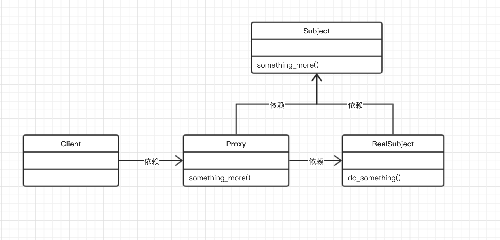

## 第五章 代理模式--控制对象的访问
本章进一步学习结构型设计模式中的代理模式。我们讨论一下主题：
* 介绍代理和代理设计模式
* 代理模式的UML
* 代理模式的变体
* 代码实现真实示例
* 代理模式的优点
* 门面模式和代理模式之间的比较
* 常见问答

### 5.1 理解代理设计模式
代理通常就是一个介于寻求方和提供方之间的中介系统。
寻求方是发出请求的一方，而提供方则是根据请求提供资源的一方。
在Web世界中，它相当于代理服务器。

客户端（万维网中的用户）在向网站发出请求时，首先连接到代理服务器，
然后向它请求诸如网页之类的资源。代理服务器在内部评估此请求，将其发送到适当的服务器，
当它收到响应后，就会将响应传递给客户端。

因此，代理服务器可以封装请求、保护隐私，并且非常适合在分布式架构中运行。

在设计模式的上下文中，代理是充当实际对象接口的类。对象类型可以是多样化的，
例如网络连接、内存和文件中的大对象，等等。

简而言之，代理就是封装实际服务对象的包装器或代理人。
代理可以为其包装的对象提供附加功能，而无需更改对象的代码。
代理模式的主要目的是为其他对象提供一个代理者或占位符，从而控制对实际对象的访问。

代理模式可以用于多种场景：
* 它能够以更简单的方式表示一个复杂的系统。例如，涉及多个复杂计算或过程的系统
应该提供一个更简单的接口，让它充当客户端的代理。
* 它提高了现有的时间对象的安全性。在许多情况下，都不允许客户端直接访问实际对象。
这是因为实际对象可能受到恶意活动的危害。这时候，代理就能起到抵御恶意活动的盾牌作用，
从而保护了实际的对象。
* 它为不同的服务器上的远程对象提供本地接口。一个明显的例子是客户端希望在远程系统上
运行某些命令的分布式系统，但客户端可能没有直接的权限来实现这一点。
因此它将请求转交给本地对象（代理），然后由远程机器上的代理执行该请求。
* 它为消耗大量内存的对象提供了一个轻量级的句柄。有时，你可能不想加载主要对象，
除非它们真的有必要。这是因为实际对象真的很笨重，可能需要消耗大量资源。
一个典型的例子是网站用户的个人简介头像。你最好在列表视图中显示头像的缩略图，当然，
为了展示用户简介的详细介绍，你就需要加载实际图片了。

让我们通过一个简单例子来理解该模式。不妨以演员与他的经纪人为例，当制作公司想要找
演员拍电影时，它们通常会与经纪人交流，而不是直接跟演员交流。经纪人会根据演员的
日程安排和其他合约情况，来答复制作公司该演员是否有空，以及是否对该影片感兴趣。
在这种情况下，制作公司并不直接找演员交涉，而是通过经纪人作为代理，处理所有与
演员有关的调度和片酬问题。

下面的Python代码实现了这种场景，其中Agent是代理。对象Agent查看Actor是否
正处于忙碌状态。如果Actor正忙，则调用`Actor().occupied()`方法；如果
Actor不忙，则返回`Actor().available()`方法。
```
class Actor(object):
    def __init__(self):
        self.isBusy = False
    
    def occupied(self):
        self.isBusy = True
        print(type(self).__name__, "is occupied with current movie")
    
    def available(self):
        self.isBusy = False
        print(type(self).__name__, "is free for the movie")
    
    def getStatus(self):
        return self.isBusy

class Agent(object):
    def __init__(self):
        self.principal = None
    
    def work(self):
        self.actor = Actor()
        if self.actor.getStatus():
            self.actor.occupied()
        else:
            self.actor.available()

if __name__ == "__main__":
    r = Agent()
    r.work()
```
代理设计模式主要完成了一下工作：
* 它为其他对象提供了一个代理，从而实现了对原始对象的访问控制。
* 它可以用作一个层或者接口，以支持分布式访问。
* 它通过增加代理，保护真正的组件不受意外的影响。

### 5.2 代理模式的UML类图
现在我们可以借助于下面的UML类图来探讨代理模式。正如我们在上一节中所介绍的那样，
代理模式有三个主要角色：制作公司、经纪人和演员。

下面让我们把这些角色放入一个UML图中，看看这些类如何关联：

观察这个UML类图，可以发现这个模式有下述3个主要参与者。
* **代理**：它维护一个引用，允许代理（Proxy）通过这个引用来访问实际对象。
它提供了一个与主题（Subject）相同的接口，以便代理可以替换真实的主题。
代理还负责创建和删除真实主题（RealSubject)。
* **主题**：它定义了RealSubject和Proxy的公共接口。以Proxy和RealSubject
的形式实现主题（Subject），使用RealSubject的任何地方都可以使用代理（Proxy）。
* **真实主题**：它定义代理（Proxy）所代表的的真实对象。

从*数据结构*的角度来看，UML图可以表示如下：
* **代理**：它是一个控制对RealSubject类访问的类。它处理客户端的请求，
负责创建或删除RealSubject。
* **主题/真实主题**：主题是定义真实主题（RealSubject）和代理（Proxy)
相类似的接口。Proxy是Subject接口的实际实现，并且是访问了RealSubject的某些方法实现的。
它提供了真正的功能，然后由客户端使用。
* **客户端**：它访问要完成工作的Proxy类。Proxy在内部控制对RealSubject的访问，
并引导客户端（Client）所请求的工作。

### 5.3 了解不同类型的代理
在许多常见的情形中，都会用到代理。在本章开头部分，我们已经对部分情形进行了讨论。
根据代理的使用方式，我们可以将它们分为虚拟代理、远程代理、保护代理和智能代理。

#### 5.3.1 虚拟代理


