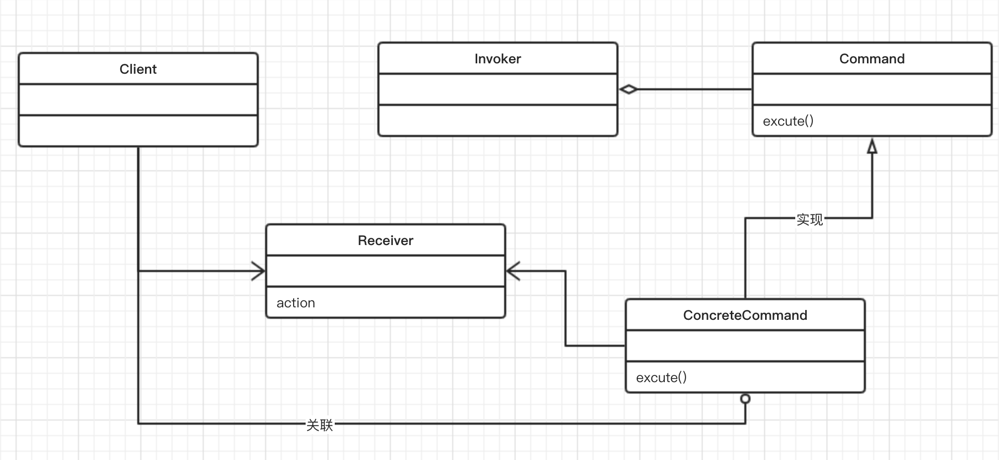

## 第七章 命令模式--封装调用
本章中，讨论命令设计模式。就像观察者模式一样，命令模式也属于行为模式的范畴。
先介绍它，再讨论如何在软件应用程序开发中应用它。然后一个用例。
本章介绍如下主题：
* 命令模式简介
* 命令模式及其UML图
* Python 3.8 代码实现的用例
* 命令模式的优缺点
* 常见问答

### 7.1 命令设计模式简介
如上一章所看到的那样，行为模式侧重于对象的响应性。它利用对象之间的交互实现更强大的功能。
命令模式也是一种行为设计模式，其中对象用于封装在完成一项操作时或在触发一个事件时所需的
全部信息。这些信息包含以下内容：
* 方法名称
* 拥有方法的对象
* 方法参数的值

让我们用一个非常简单的软件例子来理解该模式，如安装向导。
通常情况下，安装向导通过多个步骤或屏幕来了解用户的偏好。
因此，当用户使用向导时，他/她需要作出某些选择。通常来说，向导可以使用命令模式来实现。
向导会首先启动一个名为Command的对象。
用户在向导的多个步骤中指定首选项或选项将存储在Command对象中。
当用户在向导的最后一个屏幕上单机Finish按钮时，Command对象就会运行`execute()`方法，
该方法会考察所有存储的选项并完成相应的安装过程。
因此，关于选择的所有信息被封装在稍后用于采取动作的对象中。

另一个简单的例子是打印机后台处理程序。假脱机程序可以用Command对象的形式来实现，
该对象用于存储页面类型（A5-A1）、纵向/横向、分选/不分选等信息。
当用户打印东西（例如图像）时，假脱机程序就会运行Command对象的`execute()`方法，
并使用设置的首选项打印图像。

### 7.2 了解命令设计模式
命令模式通常使用以下术语：Command、Receiver、Invoker和Client
* Command对象了解Receiver对象的情况，并能调用Receiver对象的方法
* 调用者方法的参数值存储在Command对象中
* 调用者知道如何执行命令
* 客户端用来创建Command对象并设置其接收者

命令模式的主要意图如下：
* 将请求封装为对象
* 可用不同的请求对客户进行参数化
* 允许将请求保存在队列中
* 提供面向对象的回调

命令模式可用于以下各种情景：
* 根据需要执行的操作对对象进行参数化
* 将操作添加到队列并在不同地点执行请求
* 创建一个结构来根据较小操作完成高级操作

假设我们要开发一个安装向导，或者更常见的安装程序。通常，
安装意味着需要根据用户做出的选择来复制或移动文件系统中的文件。
在下面示例中，我们首先在客户端代码中创建`Wizard`对象，
然后使用`preferences()`方法存储用户在向导的各个屏幕期间做出的选择。
在向导中单机Finish按钮时，就会调用`execute()`方法。
之后，`execute()`方法将会根据首选项来开始安装：
```
#! -*- conding=utf-8 -*-
class Wizard():
    def __init__(self, src, rootdir):
        self.choices = []
        self.rootdir = rootdir
        self.src = src
    
    def preferences(self, command):
        self.choices.append(command)
    
    def execute(self):
        for choice in self.choices:
            if list(choice.values())[0]:
                print("Copying binaries --", self.src, "to", self.rootdir)
            else:
                print("No Operation")
    
if __name__ == "__main__":
    ## Client code
    wizard = Wizard("python 3.8.gizp", "/usr/bin/")
    ## Users chooses to install Python only
    wizard.preferences({'python':True})
    wizard.preferences({'java':False})
    wizard.execute()
```
上述代码的输出如下：
```
Copying binaries -- python 3.8.gizp to /usr/bin/
No Operation
```
[代码版本：Python v3.8.0](../相关代码/第七章/7.2.py)
#### 命令模式的UML类图
命令模式的主要参与者为：Command、ConcreteCommand、Receiver、Invoker、Client。

让我们看UML图，这些类是如何交互的：

通过UML类图不难发现，该模式主要涉及5个参与者。
* Command：声明执行操作的接口。
* ConcreteCommand：讲一个Receiver对象和一个操作绑定在一起。
* Client：创建ConcreteCommand对象并设定其接收者。
* Invoker：要求该ConcreteCommand执行这个请求。
* Receiver：知道如何实施与执行一个请求相关的操作。

客户端请求执行命令，调用者接受命令，封装它并将其置到队列中。ConcreteCommand类根据
所请求的命令来指导接收者执行特定的动作。通过阅读以下代码，可以帮助我们进一步了解
该模式中所有参与者的情况。
```
from abc import ABCMeta, abstractmethod
class Command(metaclass=ABCMeta):
    def __init__(self, recv):
        self.recv = recv
    @abstractmethod
    def execute(self):
        pass

class ConcreteCommand(Command):
    def __init__(self, recv):
        self.recv = recv
    
    def execute(self):
        self.recv.action()

class Receiver:
    def action(self):
        print("Receiver Action!!!!")

class Invoker:
    def command(self, cmd):
        self.cmd = cmd
    
    def execute(self):
        self.cmd.execute()

if __name__ == "__main__":
    recv = Receiver()
    cmd = ConcreteCommand(recv)
    invoker = Invoker()
    invoker.command(cmd)
    invoker.execute()
```
[代码版本：Python v3.8.0](../相关代码/第七章/7.2.uml.py)

### 7.3 实现显示世界中的命令模式
我们用证券交易所的例子来演示命令模式的实现。

作为证券交易所的用户，你会创建买入或者卖出股票的订单。
通常情况下，你无法直接执行买入或者卖出。代理和经纪人扮演了中介的角色。
代理负责将你的请求提交给证券交易所，完成工作。
我们假设你想在星期一早上开市后卖出股票。但是在星期日晚上虽然没有开市，
但你可以向代理提出卖出股票的请求。然后代理会将该请求放入排队，以便在星期一早晨
当交易所开市的时候执行该请求，完成相应的交易。
这就是一个命令模式的经典情形。

#### 设计注意事项
对于前面的UML类图，我们应该创建一个Order接口来定义客户端下达的订单。作为Command角色。
我们还应该定义ConcreteCommand类来买卖股票。
此外，还需要为证券交易所定义一个类，作为实际执行交易的Receiver类，以及接收订单并交由
接收者执行的代理（称为调用者）。

首先介绍Command对象，即Order：
* Command对象由Order类表示；
* Order提供了一个接口（Python的抽象基类），以便ConcreteCommand可以实现该行为
* execute()方法是需要由ConcreteCommand类来实现的抽象方法

下面的代码提供了抽象类Order和抽象方法execute():
```
from abc import ABCMeta, abstractmethod
#  Command
class Order(metaclass= ABCMeta):
    @abstractmethod
    def execute(self):
        pass
```
我们还开发了表示ConcreteCommand的某些类
* 这里有两个主要的具体类：BuyStockOrder和SellStockOrder，它们实现了Order接口；
* 这两个ConcreteCommand类都使用股票交易系统的对象，所以它们可以为交易系统定义适当的操作。
* 每个ConcreteCommand类的execute()方法使用股票交易对象执行相应的操作。
```
# ConcreteCommand1
class BuyStockOrder(Order):
    def __init__(self, stock):
        self.stock = stock
    
    def execute(self):
        self.stock.buy()

# ConcreteCommand2
class SellStockOrder(Order):
    def __init__(self, stock):
        self.stock = stock
    
    def execute(self):
        self.stock.sell()
```
现在让我们讨论股票交易系统及其实现：
* StockTrade类表示该示例中的Reciever对象；
* 它定义了多个方法（动作）来执行ConcreteCommand对象发出的订单；
* buy()和sell()方法由接收者定义，分别由BuyStockOrder和SellStockOrder调用以在交易所中
买入或卖出股票；

让我们来看看StockTrade类：
```
# Receiver(命令实际执行者)
class StockTrade:
    def buy(self):
        print("You will buy stock!!!")
    
    def sell(self):
        print("Yout will sell stock!!!")
```
另一部分代码是关于调用者的：
* Agent类表示调用者；
* 代理是客户端和StockTrade之间的中介，并执行客户下达的订单；
* 代理定义了一个作为队列的数据成员__orderQueue（队列），客户端下达的任何新订单都将添加到队列中；
* 代理的placeOrder()方法负责对订单排序。
* 代理的execute()方法负责按照队列顺序执行订单。

以下代码描述了扮演调用者角色的Agent类（Invoker）：
```
# Invoker（命令的调用者）
class Agent:
    def __init__(self):
        self.__orderQueue = []
    
    def placeOrder(self, order):
        self.__orderQueue.append(order)
    
    def execute(self):
        for order in self.__orderQueue:
            order.execute()
```
现在看看客户端是如何实现的：
* 客户首先设置接收者，StockTrade类；
* 他使用BuyStockOrder和SellStockOrder（ConcreteCommand）创建订单来买卖股票，
执行StockTrade的相关操作；
* 调用者对象是通过实例化Agent类创建的；
* Agent的placeOrder()方法用于获取客户端所下的订单。
* execute()方法用于执行所有接收到的订单（命令）

以下是客户端的实现代码：
```
if __name__ == "__main__":
    # Client
    stock = StockTrade()
    buyStockOrder = BuyStockOrder(stock)
    sellStockOrder = SellStockOrder(stock)

    # Invoker
    agent = Agent()
    agent.placeOrder(buyStockOrder)
    agent.placeOrder(sellStockOrder)
    agent.execute()
```
上述所有代码输出为：
```
You will buy stock!!!
Yout will sell stock!!!
```
[代码版本：Python v3.8.0](../相关代码/第七章/7.3.py)

在软件中应用命令模式的方式有很多种。我们将讨论与云应用密切相关的两个实现。
* 重做或者回滚操作
    - 在实现回滚或重做操作时，开发人员可以做两件不同的事
    - 这些是在文件系统或内存中创建快照，当被要求回滚时，恢复到该快照；
    - 使用命令模式时，可以存储命令序列，并且要求进行重做时，重新运行相同的一组操作即可。
* 异步任务执行
    - 在分布式系统中，我们通常要求设备具备异步执行任务的功能，以便核心服务在大量请求涌来时不会发生阻塞
    - 在命令模式中，Invoker对象可以维护一个请求队列，并将这些任务发送到Receiver对象，
    以便它们可以独立于主应用程序来完成相应的操作。

### 7.4 命令模式的优缺点
命令模式具有以下优点：
* 将调用操作的类与指导如何执行该操作的对象解耦；
* 提供队列系统后，可以创建一系列命令；
* 添加新命令更加容易，并且无需更改现有代码；
* 还可以使用命令模式来定义回滚系统，例如，在向导示例中，我们可以编写一个回滚方法。

命令模式的缺点：
* 为了实现目标，需要大连的类和对象进行协作。应用程序开发人员为了正确开发这些类，需要倍加小心；
* 每个单独的命令都是一个ConcreteCommand类，从而增加了需要实现和维护的类的数量。

### 7.5 常见问答
Q1. 命令模式中是否可以不实现Receiver和ConcreteCommand？

A：是的。许多软件应用程序也就是通过这种方式来使用命令模式的。这里一定要注意的是调用者和接收者之间的交互。
如果接收器未被定义的话，则去耦程度就会下降；此外，参数化命令的优势也就不复存在了。

Q2. 我使用什么数据结构来实现Invoker对象中的队列机制？
A：在本章的股票交易示例中，我们使用一个列表来实现队列。但是命令模式还可以使用一个堆栈来实现队列机制，
这在开发具有重做或者回滚功能的时候非常有帮助。

