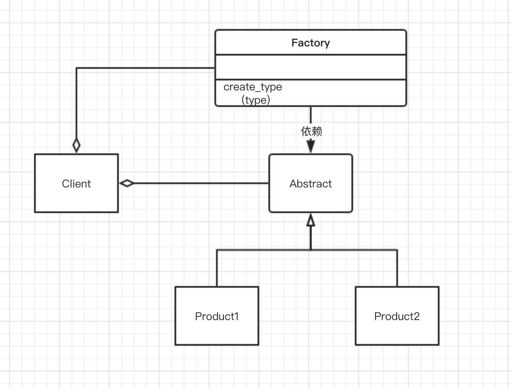
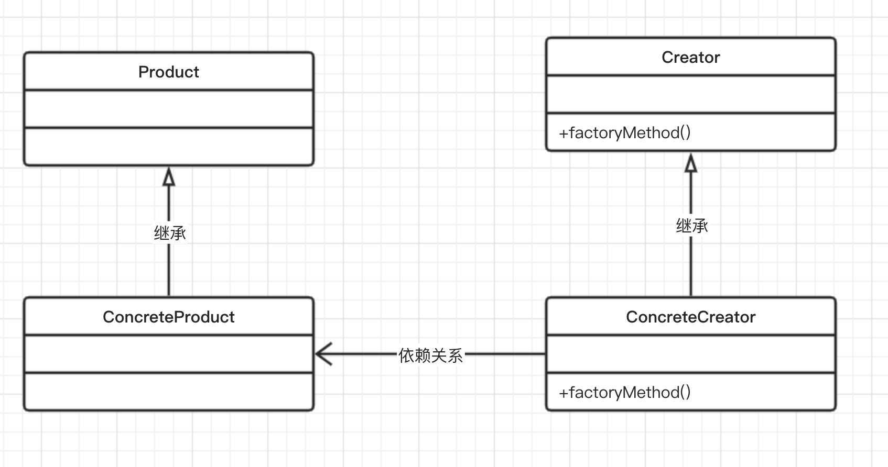
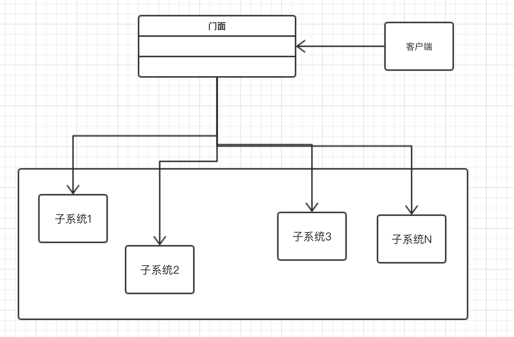

# 《python设计模式》

## 第一章 设计模式简介
### 1.1 理解面向对象编程
面向对象的世界引入了对象的概念，而这些对象又具有属性属性（数据成员）
和过程（成员函数）。这些函数的作用就是处理属性。
在Python中，一切皆对象，每个类的实例或变量都有它自己的内存地址或身份。
对象就是类的实例，应用开发就是通过让对象交互来实现目的的过程。
#### 1.1.1 对象
* 他们表示所开发的应用程序内的实体
* 实体之间可以通过交互来解决现实世界的问题。

例如，Person是实体，而Car也是实体。Person可以驾驶Car，从一个地方开到另一个地方。
#### 1.1.2 类
类可以帮助开发人员表示现实世界中的实体。
* 类可以定义对象的属性和行为。属性是数据成员，行为由成员函数表示。
* *类包含了构造函数，这些函数的作用是为对象提供初始状态。*
* 类就像模板一样，非常易于重复使用。

例如，类Person可以带有属性name和age，同时提供成员函数gotoOffice()，以定义去办公室的行为。
#### 1.1.3 方法
方法在面向对象世界中的作用：
* 它们表示对象的行为。
* 方法可以对属性进行处理，从而实现所需的功能。
创建类和对象的例子
```
class Person(object):
    def __init__(self, name, age):    # constructor
        self.name = name    # data members/ attributes
        self.age = age
    def get_person(self, ):    # member function
        return "<Person (%s, %s)>" % (self.name, self.age)
    
p = Person("John", 32)    # p is an object of type Person
print("Type of Object:", type(p), "Memory Address:", id(p))
```
上述代码输出结果如下：
```
Type of Object: <class '__main__.Person'> Memory Address: 4378733296
```
[代码版本：Python v3.8.0](./相关代码/第一章/1.1.3.py)

### 1.2 面向对象编程的主要概念
#### 1.2.1 封装
主要特点：
* 对象的行为对于外部世界来说是不可见的，或者说对象的状态信息是私密的。
* 客户端不能通过直接操作来改变对象的内部状态。
相反，客户端需要通过发送消息来请求兑现改变其内部状态。
对象可以根据请求的类型，通过特定的成员函数（例如get和set）
改变它们的内部状态，以做出相应的响应。
* 在Python中，封装（数据和方法的隐藏）的概念不是隐式的，
因为它没有提供封装所需的关键字，诸如public，private，protected
（在诸如C++或Java之类语言中，都提供了这类关键字）。
但在变量和函数名前面加上前缀_(protected)或__(private)，就可以达到相同效果
#### 1.2.2 多态
主要特征：
* 多态有两种类型：
    - 对象根据输入参数提供方法的不同实现。
    - 不同类型的对象可以使用相同的接口。
* 对于Python来说，多态是该语言的内置功能。
例如，操作符“+”可以应用于两个整数以进行假发运算，也可以应用于字符串来连接它们。
字符串、元组、列表都可以通过整数索引进行访问，这展示了Python内置类型的多态：
```
a = "John"
b = (1, 2, 3)
c = [1, 3, 4, 6, 8, 10]
print(a[2], b[0], c[3])
```
以上代码输出如下:
```
h 1 6
```
[代码版本：Python v3.8.0](./相关代码/第一章/1.2.2.py)

#### 1.2.3 继承
* 继承表示一个类可以继承父类的（大部分）功能。
* 继承被描述为一个重用基类中定义的功能并允许对原始软件的实现进行独立扩展的选项。
* 继承可以利用不同类的对象之间的关系建立层次结构。
与Java不同，Python支持多重继承（继承多个基类）

继承示例：
```
class A:
    def a1(self):
        print("a1")
    
class B(A):
    def b(self):
        print("b")

b = B()
b.a1()
```
输出：
```
a1
```
[代码版本：Python v3.8.0](./相关代码/第一章/1.2.3.py)

#### 1.2.4 抽象
主要特征：
* 它提供了一个简单的客户端接口，客户端可以通过该接口与类的对象进行交互，
并可以调用该接口中定义的各个方法。
* 它将内部类的复杂性抽象为一个接口，这样客户端就不需要知道内部实现了。
下面例子，我们通过add()方法对类Adder的内部细节进行了抽象处理：
```
class Adder:
    def __init__(self):
        self.sum = 0
    def add(self, value):
        self.sum += value

acc = Adder()
for i in range(100):
    acc.add(i)

print(acc.sum)
```
输出：
```
4950
```
[代码版本：Python v3.8.0](./相关代码/第一章/1.2.4.py)

#### 1.2.5 组合
* 它是一种将对象或者类组合成更复杂的数据结构或软件实现的方法。
* 在组合中，一个对象可用于调用其他模块中的成员函数，这样一来，
无需通过继承就可以实现基本功能的跨模块使用。
下面示例中，类A的对象被组合到了类B中：
```
class A(object):
    def a1(self):
        print("a1")

class B(object):
    def b(self):
        print("b")
        A().a1()

objectB = B()
objectB.b()
```
输出:
```
b
a1
```
[代码版本：Python v3.8.0](./相关代码/第一章/1.2.5.py)

### 1.3 面向对象的设计原则
当我们深入细致地学习设计模式时，面向对象的设计原则将作为工具箱使用
#### 1.3.1 开放/封闭原则
开放/封闭原则规定，类或者对象及其方法对于扩展来说，应该是开放的，
但是对于修改来说，应该是封闭的。
简单地说，这意味着当你开发软件应用的时候，一定确保以通用的方式来编写类或模块，
以便每当需要扩展类或对象行为的时候不必修改类本身。
相反，类的简单扩展将有助于建立新的行为。
例如，开放/封闭原则能够在下列情形中表现的淋漓尽致：为了实现所需行为，
用户必须通过扩展抽象基类来创建类的实现，而不是通过修改抽象类。
该设计原则的优点如下：
* 现有的类不会被修改，因此退化的可能性较小。
* 它还有助于保持以前代码的向后兼容性。
#### 1.3.2 控制反转原则
控制反转原则是指，高层级的模块不应该依赖于低层级的模块，
它们都应该依赖于抽象。
细节应该依赖于抽象，而不是抽象依赖于细节。
该原则建议任何两个模块都不应该以紧密方式相互依赖。事实上，
基本模块和从属模块应当在它们之间提供一个抽象层来耦合。
这个原则还建议，类的细节应该描绘抽象。

在某些情况下，这种观念会反转，也就是实现细节本身决定了抽象，这种情况是应该避免的。

控制反转原则的优点如下：
* 削弱了模块间的紧耦合，因此消除了系统中的复杂性/刚性。
* 由于在依赖模块之间有一个明确的抽象层（由钩子或者参数提供），
因此便于通过更好的方式处理模块之间的依赖关系。

#### 1.3.3 接口隔离原则
接口隔离原则规定，客户端不应该依赖于它们不需要使用的接口。
接口隔离原则的意思就是，软件开发人员应该仔细地处理接口。
例如，它提醒开发人员/架构师开发的方法要与特定功能紧密相关。
如果存在与接口无关的方法，那么依赖于该接口的类就必须实现它，实际上这是毫无必要的。
例如，一个Pizza接口不应该提供名为add_chicken()的方法。
基于Pizza结构的Veg Pizza类不应该强制实现该方法。
该设计原则优点：
* 他强制开发人员编写“瘦身型”接口，并使方法与接口紧密相关。
* 防止向接口中随意添加方法。

#### 1.3.4 单一职责原则
单一职责的含义是：类的职责单一，引起类变化的原因单一。
这个原则是说，当我们开发类时，它应该为特定的功能服务。
如果一个类实现了两个功能，那么最好将它们分开。
也就是说，功能才是改变的理由。
例如，一个类可以因为所需行为的变化而进行修改，
但是如果一个类由于两个因素(基本上是两个功能的改变)而改变，
那么该类就应该进行相应的分割。
该设计原则的优点：
* 每当一个功能发生变化时，除了特定的类需要改变外，其他类无需变动。
* 此外，如果一个类有多种功能，那么依赖它的类必定会由于多种原因
而经历多次修改，这是应该避免的。

#### 1.3.5 替换原则
替换原则规定，派生类必须能够完全取代基类。
这个原则很简单，当应用程序开发人员编写派生类时，该原则的含义就是他们应该扩展基类。
此外，它还建议派生类应该尽可能对基类封闭，以至于派生类本身可以替换基类，
而无需修改任何代码。

### 1.4 设计模式的概念
什么是设计模式呢？
根据GoF的观点，设计模式就是解决特定问题的解决方案。
设计模式本身是一种发现，而不是一种发明。
设计模式的主要特点：
* 它们是语言无关的，可以用多种语言实现。
* 它们是动态的，随时会有新的模式引入。
* 它们可以进行定制，因此对开发人员非常有用。

你必须尝试解决设计模式想要解决的问题，也许你的解决方案并不完善，
而我们所追求的完善性正是设计模式中固有的或隐含的。
当我们提到完整性时，它可以指许多因素。例如，设计、可扩展性、
重用、内存利用率等。从本质上说，设计模式就是从别人的成功而非
自己的失败中进行学习！
关于设计模式的另一个有趣的讨论是，什么时候使用他们？他是应用在
软件开发生命周期（Software Development Life Cycle，SDLC）
的分析或设计阶段吗？
有趣的是，设计模式是已知问题的解决方案。
因此设计模式在分析或设计阶段非常有用，并且如预期的那样，
在开发阶段也非常有用，因为他们与应用的编程直接相关。
#### 1.4.1 设计模式的优点
* 它们可以在多个项目中重复使用。
* 问题可以在架构级别得到解决。
* 它们都经过了时间的验证和良好的证明，是开发人员和架构师的宝贵经验。
* 它们具有可靠性和依赖性。
#### 1.4.2 设计模式的分类
不是每一段代码或者每一种设计都可以叫做设计模式。
例如，解决一个问题的编程构造或数据结构就不能被称为模式。
下面通过一种简单的方式来理解这些术语。
* 代码段：用某种语言编写的一段具有特定用途的代码，例如，他可以是Python
中的DB连接代码。
* 设计：用来解决某个特定问题的优秀解决方案。
* 标准：这是一种解决某类问题的方法，它非常通用，并适用于当前的情况。
* 模式：这是一个经过时间考验的、高效、可扩展的解决方案，能够解决一类已知问题。
#### 1.4.3 上下文--设计模式的适用性
为了有效使用设计模式，应用程序开发人员必须了解设计模式所适用的上下文。
我们可以将上下文分为以下几种主要类型：
* 参与者：它们是在设计模式中用到的类。类可以在模式中扮演不同的角色，以完成多个目标。
* 非功能需求：诸如内存优化、可用性和性能等需求都属于此类型。
由于这些因素影响整个软件解决方案，因此至关重要。
* 权衡：并非所有的设计模式都适合于应用程序开发，因此需要权衡。
这些是在应用程序中使用谁模式时所做的决策。
* 结果：如果上下文不合适，设计模式可能对代码的其他部分产生负面影响。
开发人员应该了解设计模式的结果和用途。
### 1.5 动态语言的设计模式
就像Lisp一样，Python也是一种动态语言。
Python动态特性如下：
* 类型或类是运行时对象。
* 变量可以根据赋值来确定类型，并且类型可以在运行时改变。例如，
a=5和a="john"，变量a在运行时被赋值，而且其类型也发生了变化。
* 动态语言在类限制方面具有更大的灵活性。
例如，在Python中，多态性是该语言所固有的，并没有诸如private
和protected之类的关键字，因为默认情况下一切都是公共的。
* 可以使用动态语言轻松实现设计模式的用例。
### 1.6 模式的分类
GoF在他的设计模式中讲到了23种设计模式，并将它们分为3大类。
* 创建型模式
* 结构型模式
* 行为型模式

模式的分类主要基于对象的创建方式、软件应用程序中类和对象的构造方式，
同时还涉及对象之间的交互方式。
#### 1.6.1 创建型模式
创建型模式的性质：
* 它们的运行机制基于对象的创建方式。
* 它们将对象创建的细节隔离开来。
* 代码与所创建的对象的类型无关。

单例模式是创建型模式的一个例子。
#### 1.6.2 结构型模式
结构型模式的性质：
* 它们致力于设计出能够通过组合获得更强大功能的对象和类的结构。
* 重点是简化结构并识别类和对象之间的关系。
* 它们主要关注类的继承和组合。

适配器模式是结构型模式的一个例子。
#### 1.6.3 行为型模式
行为型模式的性质：
* 它们关注对象之间的交互以及对象的响应性。
* 对象应该能够交互，同时仍然保持松散耦合。

观察者模式是行为模式的一个例子。
## 第二章 单例设计模式
单例设计模式是应用开发过程中最简单和最著名的一种创建型设计模式。
本章还会介绍Monostate（或者Borg）设计模式，它是单例设计模式的一个变种。
本章涉及主题：
* 理解单例设计模式
* 单例模式实例
* 单例设计模式的Python实现
* Monostate（Borg）模式
### 2.1 理解单例设计模式
单例模式提供了这样一个机制，即确保类有且只有一个特定类型的对象，并提供全局访问点。
因此，单例模式通常用于下列情形，例如日志记录或数据库操作、打印机后台处理程序，
以及其他程序---该程序运行过程中只能生成一个实例，以避免对同一资源产生相互冲突的请求。
例如，我们可能希望使用一个数据库对象对数据库进行操作，以维护数据的一致性；
或者希望一个日志类的对象，将多项服务的日志信息按照顺序转储存到一个特定的日志文件中。
简言之，单例模式特点如下：
* 确保类有且只有一个对象被创建。
* 为对象提供一个访问点，以使用程序可以全局访问该对象。
* 控制共享资源的并行访问。

实现单例模式的一个简单地方法是，使构造函数私有化，并创建一个静态方法来完成对象的初始化。
这样，对象在第一次调用时创建，此后这个类将返回同一个对象。
在使用Python的时候，我们实现方式要有所变通，因为它无法创建私有的构造函数。
#### 利用Python实现经典的单例模式
下面是基于Python的单例模式实现代码，它主要完成了两件事情。
1. 只允许Singleton类生成一个实例。
2. 如果已经有了一个实例了，我们会重复提供同一个对象。
具体代码如下:
```
class Singleton(object):
    def __new__(cls):
        if not hasattr(cls, 'instance'):
            cls.instance = super().__new__(cls)
        return cls.instance

s = Singleton()
print('Object created', s)

s1 = Singleton()
print('Object created', s1)
```
输出
```
Object created <__main__.Singleton object at 0x107b051f0>
Object created <__main__.Singleton object at 0x107b051f0>
<__main__.Singleton object at 0x10a1af1f0>
```
[代码版本：Python v3.8.0](./相关代码/第二章/2.1.py)

在上面的代码中，我们通过覆盖`__new__`方法（Python用于实例化对象的特殊方法）
来控制对象的创建。对象s就是由`__new__`方法创建的，但在创建之前，
该方法会检查对象是否已存在。
方法hasattr（Python的特殊方法，用来了解对象是否具有某个属性）
用于查看对象cls是否具有属性instance，该属性的作用是检查该类是否已经生成了一个对象。
当对象s1被请求的时候，hasattr()发现对象已经存在，
所以，对象s1将被分配已有的对象实例（地址位于0x10a1af1f0）
### 2.2 单例模式中的懒汉式实例化
单例模式的用例之一就是懒汉式实例化。例如，再导入模块的时候我们可能会无意中创建一个对象，
但当时根本用不到它。懒汉式实例化能够确保在实际需要时才创建对象。
所以，懒汉式实例化是一种节约资源并仅在需要时才创建它们的方式。

在下面的代码示例中，执行`s = Singleton()`的时候，它会调用`__init__`方法，
但没有新的对象被创建。然而，实际的对象创建发生在调用`Singleton.getInstance()`
的时候，我们正是通过这种方式来实现懒汉式实例化的。

```
class Singleton:
    __instance = None
    def __init__(self):
        if not Singleton.__instance:
            print(" __init__method called..")
        else:
            print("Instance already created:", self.getInstance())
    @classmethod
    def getInstance(cls):
        if not cls.__instance:
            cls.__instance = Singleton()
        return cls.__instance
    
s = Singleton()  ## class initialized, but object not created
print('*' * 80)
print("Object created", Singleton.getInstance())  # Object gets created here
print('*' * 80)
s1 = Singleton()  ## instance already created
```
输出：
```
 __init__method called..
********************************************************************************
 __init__method called..
Object created <__main__.Singleton object at 0x106330250>
********************************************************************************
Instance already created: <__main__.Singleton object at 0x106330250>
```
[代码版本：Python v3.8.0](./相关代码/第二章/2.2.py)

### 2.3 模块级别的单例模式
默认情况下，所有模块都是单例，这是由Python的导入行为所决定的。
Python通过下列方式来工作。
1. 检查一个Python模块是否已经导入。
2. 如果已经导入，则返回该模块的对象。
如果还没有导入，则导入该模块，并实例化。
3. 因此，当模块被导入的时候，它就会被实例化。然而，当同一个模块被再次导入的时候，
它不会再次初始化，因为单例模式只能有一个对象，所以，它会返回同一个对象。
### 2.4 Monostate单例模式
GoF的单例设计模式是指，一个类有且只有一个对象。
根据Alex Martelli的说法，通常程序员需要的是让实例共享相同的状态。
他建议开发人员应该关注状态和行为，而不是同一性。
由于该概念基于所有对象共享相同状态，因此它也被称为Monostate（单态）模式。
Monostate模式可以通过Python轻松实现。在下面的代码中，我们将类变量
`__shared_state`赋给变量`__dict__`（它是Python的一个特殊变量）。
Python使用`__dict__`存储一个类所有对象的状态。在下面的代码中，
我们故意把`__shared_state`赋给所有已经创建的实例。
所以，如果我们创建了两个实例“b”和“b1”，我们将得到两个不同的对象，
这一点与单例模式大为不同，后者只能生成一个对象。
然而对象的状态即`b.__dict__`和`b1.__dict__`却是相同的。
现在，就算对象b的对象变量x发生了变化，这个变化也会复制到被所有对象共享
的`__dict__`变量，即b1的变量x的值也会从1变为4。
```
class Borg:
    __shared_state = {"1" : "2"}
    def __init__(self):
        self.x = 1
        self.__dict__ = self.__shared_state
        pass

b = Borg()
b1 = Borg()
b.x = 4
print("Borg Object 'b': ", b)  ## b and b1 are distinct objects
print("Borg Object 'b1': ", b1)
print("Object State 'b': ", b.__dict__)  ## b and b1 share same state
print("Object State 'b1': ", b1.__dict__)
```
输出
```
Borg Object 'b':  <__main__.Borg object at 0x1097ff6a0>
Borg Object 'b1':  <__main__.Borg object at 0x1097f8940>
Object State 'b':  {'1': '2', 'x': 4}
Object State 'b1':  {'1': '2', 'x': 4}
```
[代码版本：Python v3.8.0](./相关代码/第二章/2.4.1.py)

除此以外，我们还可以通过修改`__new__`方法本身来实现Borg模式。
我们知道，`__new__`方法是用来创建对象的实例的，具体如下所示：
```
class Borg(object):
    _shared_state = {}
    def __new__(cls, *args, **kwargs):
        obj = super().__new__(cls, *args, **kwargs)
        obj.__dict__ = cls._shared_state
        return obj
b = Borg()
b1 = Borg()
b.x = 4
print("Borg Object 'b': ", b)  ## b and b1 are distinct objects
print("Borg Object 'b1': ", b1)
print("Object State 'b': ", b.__dict__)  ## b and b1 share same state
print("Object State 'b1': ", b1.__dict__)
```
输出：
```
Borg Object 'b':  <__main__.Borg object at 0x1017021f0>
Borg Object 'b1':  <__main__.Borg object at 0x101702220>
Object State 'b':  {'x': 4}
Object State 'b1':  {'x': 4}
```
[代码版本：Python v3.8.0](./相关代码/第二章/2.4.2.py)

### 2.5 单例和元类
元类是一个类的类，这意味着该类是它的元类的实例。使用元类，
程序员有机会从预定义的Python类创建自己类型的类。例如，你有一个
对象MyClass，你可以创建一个元类MyKls,它按照你需要的方式重新定义
MyClass的行为。下面，来深入介绍它们。
在Python中，一切皆对象。如果我们说`a=5`，则`type(a)`返回
`<type'int'>`，这意味着a是int类型。
但是，`type(int)`返回`<type'type'>`，这表明存在一个元类，
因为int是type类型的类。
类的定义由它的元类决定，所以当我们用类A创建一个类时，Python
通过`A=type(name, bases, dict)`创建它。
* name: 这是类的名称
* bases: 这是基类
* dict: 这是属性变量

现在，如果一个类有一个预定义的元类（名为Metals），那么Python就会通过
`A=Metals(name, bases, dict)`来创建这个类。
让我们看看一个示例元类的实现：
```
class MyInt(type):
    def __call__(cls, *args, **kwds):
        print("***** Here's My int *****", args)
        print("Now do whatever you want with these objects...")
        return type.__call__(cls, *args, **kwds)
    
class int(metaclass=MyInt):
    def __init__(self, x, y):
        self.x = x
        self.y = y

i = int(2, 7)
```
输出：
```
***** Here's My int ***** (2, 7)
Now do whatever you want with these objects...
```
[代码版本：Python v3.8.0](./相关代码/第二章/2.5.1.py)

对于已经存在的类来说，当需要创建对象时，将调用Python的特殊方法`__call__`。
在这段代码中，当我们使用int(2,7)实例化int类时，MyInt元类的`__call__`方法
将被调用，这意味着现在元类控制着对象的实例化。

前面的思路同样适用于单例设计模式。由于元类对类创建和对象实例化有更多的控制权，
所以它可以用于创建单例。（注意：为了控制类的创建和初始化，
元类将覆盖`__new__`和`__init__`方法。）

以下示例代码能够更好地帮我们解释基于元类的单例实现：
```
class MetaSingleton(type):
    _instances = {}
    def __call__(cls, *args, ** kwargs):
        if cls not in cls._instances:
            cls._instances[cls] = super().__call__(*args, **kwargs)
            print(super(),cls,'+',cls._instances)
        return cls._instances[cls]
    
class Logger(metaclass=MetaSingleton):
    pass

logger1 = Logger()
logger2 = Logger()
print(logger1, logger2)
```
输出：
```
<super: <class 'MetaSingleton'>, <MetaSingleton object>> <class '__main__.Logger'> + {<class '__main__.Logger'>: <__main__.Logger object at 0x108590250>}
<__main__.Logger object at 0x108590250> <__main__.Logger object at 0x108590250>
```
[代码版本：Python v3.8.0](./相关代码/第二章/2.5.2.py)

### 2.6 单例模式一
作为一个实际的用例，我们将通过一个数据库应用程序来展示单例的应用。
这里不妨以需要对数据库进行多种读取和写入操作的云服务为例进行讲解。
完整的云服务被分解为多个服务，每个服务执行不同的数据库操作。
针对UI（Web应用程序）上的操作将导致调用API,最终产生相应的DB操作。
很明显，跨不同服务的共享资源是数据库本身。
因此如果我们需要更好地设计云服务，必须注意以下几点：
* 数据库中操作的一致性，即一个操作不应与其他操作发生冲突。
* 优化数据库的各种操作，以提高内存和CPU的利用率。
这里提供一个示例Python实现：
```
import sqlite3
class MetaSingleton(type):
    _instances = {}
    def __call__(cls, *args, **kwargs):
        if cls not in cls._instances:
            cls._instances[cls] = super().__call__(*args, **kwargs)
        return cls._instances[cls]
    
class Database(metaclass=MetaSingleton):
    connection = None
    def connect(self):
        if self.connection is None:
            self.connection = sqlite3.connect("db.sqlite3")
            self.cursorobj = self.connection.cursor()
        return self.cursorobj

db1 = Database().connect()
db2 = Database().connect()

print("Database Objects DB1", db1)
print("Database Objects DB2", db2)
```
输出：
```
Database Objects DB1 <sqlite3.Cursor object at 0x10e877f80>
Database Objects DB2 <sqlite3.Cursor object at 0x10e877f80>
```
[代码版本：Python v3.8.0](./相关代码/第二章/2.6.py)

通过阅读上面的代码，我们会发现以下几点。
1. 我们以MetaSingleton为名创建了一个元类。就像在上一节中解释的那样，
Python的特殊方法`__call__`可以通过元类创建单例。
2. 数据库类由MetaSingleton类装饰后，其行为就会表现为单例。因此，当
数据库类被实例化时，它只能创建一个对象。
3. 当Web应用程序对数据库执行某些操作时，它会多次实例化数据库类，但只创建一个对象。
因为只有一个对象，所以对数据库的调用是同步。此外，这样还能够节约系统资源，并且可以
避免消耗过多的内存或CPU资源。

假如我们要开发的不是单个Web应用程序，而是集群化的情形，即多个Web应用共享单个数据库。

当然，单例在这种情况下好像不太好使，因为每增加一个Web应用程序，就要新建一个单例，
添加一个新的对象来查询数据库。

这导致数据库操作无法同步，并且要耗费大量的资源。
在这种情况下，数据库的链接池比实现单例要好得多。

### 2.7 单例模式二
让我们考虑另一种情况，即为基础设施提供运行状况监控服务（就像Nagios所做的那样）。

我们创建了HealthCheck类，它作为单例实现。我们还要维护一个被监控的服务器列表。

当一个服务器从这个列表中删除时，监控软件应该觉察到这一情况，并从被监控的服务器
列表中将其删除。

在下面的代码中，hc1和hc2对象与单例中的类相同。
我们可以使用`addServer()`方法将服务器添加到基础设施中，以进行运行状况检查。

首先，通过迭代对这些服务器的运行状况进行检查。之后，`changeServer()`方法

会删除最后一个服务器，并向计划进行运行状况检查的基础设施中添加一个新服务器。

因此，运行状况检查进行第二次迭代时，它会使用修改后的服务器列表。

所有这一切都可以借助单例模式来完成。当添加或删除服务器时，运行状况的检查工作
必须由了解基础设施变动情况的同一个对象来完成：
```
class HealthCheck:
    _instance = None
    def __new__(cls, *args, **kwargs):
        if not HealthCheck._instance:
            HealthCheck._instance = super().__new__(cls, *args, **kwargs)
        return HealthCheck._instance
    
    def __init__(self):
        self._servers = []
    
    def addServer(self):
        self._servers.append("Server 1")
        self._servers.append("Server 2")
        self._servers.append("Server 3")
        self._servers.append("Server 4")
    
    def changeServer(self):
        self._servers.pop()
        self._servers.append("Server 5")

hc1 = HealthCheck()
hc2 = HealthCheck()

hc1.addServer()
print("Schedule health check for servers (1)..")
for i in range(4):
    print("Checking ", hc1._servers[i])

hc2.changeServer()
print("Schedule health check for servers (2)..")
for i in range(4):
    print("Checking ", hc2._servers[i])
```
输出：
```
Schedule health check for servers (1)..
Checking  Server 1
Checking  Server 2
Checking  Server 3
Checking  Server 4
Schedule health check for servers (2)..
Checking  Server 1
Checking  Server 2
Checking  Server 3
Checking  Server 5
```
[代码版本：Python v3.8.0](./相关代码/第二章/2.7.py)
### 2.8 单例模式的缺点
虽然单例模式在许多情况下效果很好，但是这种模式仍然存在一些缺陷。
由于单例具有全局访问权限，因此可能出现以下问题：
* 全局变量可能在某处已经被误改，但是开发人员仍然认为它们没有发生
变化，而该变量还在应用程序的其他位置被使用。
* 可能会对同一对象创建多个引用。由于单例只创建一个对象，因此这种
情况下会对同一个对象创建多个引用。
* 所有依赖于全局变量的类都会由于一个类的改变而紧密耦合为全局数据，
从而可能在无意中影响另一个类。

### 提示，小结
关于单例模式以下几点需牢记：
* 在许多实际应用程序中，我们只需要创建一个对象，如线程池、缓存、
对话框、注册表设置等。如果我们为每个应用程序创建多个实例，则会
导致资源的过度使用。单例模式在这种情况下工作得很好。
* 单例是一种经过时间考验的成熟方法，能够在不带来太多缺陷的情况
下提供全局访问点。
* 该模式也有一些缺点。当使用全局变量或类实例化非常耗费资源但最终
却没有用到它们的情况下，单例的影响可以忽略不计。

## 第三章 工厂模式：建立创建对象的工厂
这一章继续学洗另一种创建型模式，即工厂模式。
工厂模式可以说是最常用的设计模式。本章了解现实世界的应用场景以及
基于Python V3.8.0的实现。此外还会对工厂方法和抽象工厂方法进行比较。
简要介绍以下主题：
* 了解简单工厂设计模式
* 讨论工厂方法和抽象工厂方法及其差异
* 利用Python代码实现真实场景
* 讨论模式的优缺点并进行相应的比较

### 3.1 了解工厂模式
在面向对象编程中，术语“工厂”表示一个负责创建其他类型对象的类。

通常情况下，作为一个工厂的类有一个对象以及与它关联的多个方法。

客户端使用某些参数调用此方法，之后，工厂会据此创建所需类型的对象，
然后将它们返回给客户端。

所以，这里的问题实际上是，既然客户端可以直接创建对象，那为什么我们还需要
一个工厂呢？答案在于，工厂具有下列优点。
* 松耦合，即对象的创建可以独立于类的实现。
* 客户端无需了解创建对象的类，但是照样可以使用它来创建对象。它只需要知道
需要传递的接口、方法和参数，就能够创建所需类型的对象了。这简化了客户端的实现。
* 可以轻松地在工厂中添加其他类来创建其他类型的对象，而这无需更改客户端代码。
最简单的情况下，客户端只需要传递另一个参数就可以了。
* 工厂还可以重用现有对象。但是，如果客户端直接创建对象的话，总是创建一个新
对象。

让我们探讨制造玩具车或玩偶的公司的情况。假设公司里的一台机器目前正在制造玩具车。

后来，公司的CEO认为，迫切需要根据市场的需求来制造玩偶。这时，工厂模式就派上
用场了。

在这种情况下，机器成为接口，CEO是客户端。CEO只关心要制造的对象（或玩具）和创建
对象的接口--机器。

Factory模式有3种变体。
1. 简单工厂模式：允许接口创建对象，但不会暴露对象的创建逻辑。
2. 工厂方法模式：允许接口创建对象，但使用哪个类来创建对象，则是交由子类决定的。
3. 抽象工厂模式：抽象工厂是一个能够创建一系列相关的对象而无需指定\公开其具体类的接口。
该模式能够提供其他工厂的对象，在其内部创建其他对象。

### 3.2 简单工厂模式
对于一些人来说，简单工厂本身不是一种模式。开发人员在进一步了解这个概念之前，
首先需要详细了解工厂方法。工厂可以帮助开发人员创建不同类型的对象，
而不是直接将对象实例化。

uml图如下：


客户端使用的是Factory类，该类具有create_type()方法。当客户端使用类型参数
调用create_type()方法时，Factory会根据传入的参数，返回Product1还是Product2。

现在让我们用代码示例来进一步理解简单工厂模式。
在下面代码段中，我们将创建一个名为Animal的抽象产品。

Animal是一个抽象的基类（ABCMeta是一个Python的特殊元类，用来生成类Abstract），
它带有方法`do_say()`。我们利用Animal接口创建了两种产品(Cat和Dog)，并实现了
`do_say()`方法来提供这些动物的相应的叫声。

ForestFactory是一个带有make_sound()方法的工厂。根据客户端传递的参数类型，
它就可以在运行时创建适当的Animal实例，并输出正确的声音。
```
from abc import ABCMeta, abstractmethod
class Animal(metaclass = ABCMeta):
    @abstractmethod
    def do_say(self):
        pass

class Dog(Animal):
    def do_say(self):
        print("Bhow Bhow!!!!")

class Cat(Animal):
    def do_say(self):
        print("Meow Meow!!!!")

## forest factory defined
class ForestFactory(object):
    def make_sound(self, object_type):
        return eval(object_type)().do_say()

## client code
if __name__ == '__main__':
    ff = ForestFactory()
    animal = input("Which animal should make_sound Dog or Cat?")
    ff.make_sound(animal)
```
输出：
```
Which animal should make_sound Dog or Cat?Cat
Meow Meow!!!!
```
或者输出：
```
Which animal should make_sound Dog or Cat?Dog
Bhow Bhow!!!!
```
[代码版本：Python v3.8.0](./相关代码/第三章/3.2.py)
### 3.3 工厂方法模式
以下几点可以帮助我们了解工厂方法模式。
* 我们定义了一个接口来创建对象，但是工厂本身并不负责创建对象，
而是将这一任务交由子类来完成，即子类决定了要实例化哪些类。
* Factory方法的创建是通过继承而不是通过实例化来完成的。
* 工厂方法使设计更加具有可定制性。它可以返回相同的实例或子类，
而不是某种类型的对象（就像在简单工厂方法中的那样）。

uml图如下：


有一个包含factoryMethod()方法的抽象类Creator。
factoryMethod()方法负责创建指定类型的对象。

ConcreteCreator类提供了一个实现Creator抽象类的
factoryMethod()方法，这种方法可以在运行时修改已创建的对象。

ConcreteCreator创建ConcreteProduct，并确保其创建的对象实现了
Product类，同时为Product接口中的所有方法提供相应的实现。

简而言之，Creator接口的factoryMethod()方法和ConcreteCreator类
共同决定了要创建Product的哪个子类。因此，工厂方法模式定义了一个接口
来创建对象，但具体实例化哪个类则是它的子类决定的。
#### 3.3.1 实现工厂方法
让我们拿一个现实世界的场景来理解工厂方法的实现。

假设我们想在不同类型的社交网络（例如LinkedIn、Facebook等）上为个人或公司建立简介。
那么，每个简介都有某些特定的组成章节。

在LinkedIn的简介中，有一个章节是关于个人申请的专利或出版作品的。
在Facebook上，你将在相册中看到最近度假地点的照片区。
此外，在这两个简介中，都有一个个人信息的区。简而言之，
我们要通过将正确的区添加到相应的简介中来创建不同类型的简介。

下面来看具体实现。在下面代码示例中，首先定义接口Product。

我们将创建一个Section抽象类来定义一个区是关于哪方面内容的，让它尽量保持简单，
同时还提供一个抽象方法`description()`。
然后，我们会创建多个ConcreteProduct，PersonalSection、AlbumSection、
PatentSection和PublicationSection类。
这些类用于实现`describe()`抽象方法并打印它们各自的区名称。
```
from abc import ABCMeta, abstractmethod

# Product
class Section(metaclass = ABCMeta):
    @abstractmethod
    def describe(self):
        pass

# ConcreteProduct
class PersonalSection(Section):
    def describe(self):
        print("Personal Section!!!")

# ConcreteProduct
class AlbumSection(Section):
    def describe(self):
        print("Album Section!!!")

# ConcreteProduct
class PatentSection(Section):
    def describe(self):
        print("Patent Section!!!")

# ConcreteProduct
class PublicationSection(Section):
    def describe(self):
        print("Publication Section!!!")
```

我们创建了一个名为Profile的抽象类Creator。Profile[Creator]抽象类
提供了一个工厂方法，即`createProfile()`。
`createProfile()`方法应该由ConcreteCreator类来实现，
来实际创建带有适当区的简介。

Profile抽象类不知道每个简介应具有哪些区。例如，Facebook的简介应该
提供个人信息区和相册区。所以，我们将让子类决定这些事情。

我们创建了两个ConcreteCreator类，即linkedin和facebook。每个类都
实现createProfile()抽象方法，
由该方法在运行时创建（实例化）多个区（ConcreteProduct）：
```
# Creator
class Profile(metaclass=ABCMeta):
    def __init__(self):
        self.sections = []
        self.createProfile()
    @abstractmethod
    def createProfile(self):
        pass
    def getSections(self):
        return self.sections
    def addSections(self, section):
        self.sections.append(section)

# ConcreteCreator
class linkedin(Profile):
    def createProfile(self):
        self.addSections(PersonalSection())
        self.addSections(PatentSection())
        self.addSections(PublicationSection())

# ConcreteCreator
class facebook(Profile):
    def createProfile(self):
        self.addSections(PersonalSection())
        self.addSections(AlbumSection())
```
最后我们开始编写决定实例化哪个ConcreteCreator类的客户端代码，
以便让它根据指定的选项创建所需的简介：
```
# client
if __name__ == "__main__":
    profile_type = input("Which Profile you'd like to create? [LinkedIn or Facebook]")
    profile = eval(profile_type.lower())()
    print("Creating Profile...", type(profile).__name__)
    print("Profile has sections --", profile.getSections())
```
现在, 运行完整代码，它会首先要求输入要创建的简介名称。在以下输出示例中我们以
facebook为例。然后它实例化facebook[ConcreteCreator]类。
它会在内部创建ConcreteProduct，也就是说，将实例化PersonalSection和AlbumSection。
最后以上三段代码合起来会输出以下：
```
Which Profile you'd like to create? [LinkedIn or Facebook]facebook
Creating Profile... facebook
Profile has sections -- [<__main__.PersonalSection object at 0x100f53700>, <__main__.AlbumSection object at 0x100f53760>]
```
如果选择LinkedIn，则会创建PersonalSection、PatentSection和PublicationSection。
如下
```
Which Profile you'd like to create? [LinkedIn or Facebook]linkedin
Creating Profile... linkedin
Profile has sections -- [<__main__.PersonalSection object at 0x10aad0700>, <__main__.PatentSection object at 0x10aad0760>, <__main__.PublicationSection object at 0x10aad0730>]
```
[代码版本：Python v3.8.0](./相关代码/第三章/3.3.py)
#### 3.3.2 工厂方法模式的优点
* 它具有更大的灵活性，使得代码更加通用，因为它不是单纯地实例化某个类。
这样实现哪些类取决于接口（Product），而不是ConcreteProduct类。
* 它们是松耦合的，因为创建对象的代码与使用它的代码是分开的。
客户端完全不需要关心传递哪些参数以及需要实例化哪些类。
由于添加新类更加容易，所以降低了维护成本。
### 3.4 抽象工厂模式
抽象工厂模式的主要目的是提供一个接口来创建一系列相关对象，而无需指定具体的类。
工厂方法将创建实例的任务委托给了子类，而抽象工厂方法的目标是创建一系列相关对象。
如下UML图所示，ConcreteFactory1和ConcreteFactory2是通过AbstractFactory
接口创建的。此接口具有创建多种产品的相应方法。

ConcreteFactory1和ConcreteFactory2实现了AbstractFactory，并创建实例
ConcreteProduct1、ConcreteProduct2、AnotherConcreteProduct1和
AnotherConcreteProduct2。

在这里，ConcreteProduct1和ConcreteProduct2是通过AbstractProduct接口
创建的，而AnotherConcreteProduct1和AnotherConcreteProduct2则是通过
AnotherAbstractProduct接口创建的。

实际上抽象工厂模式不仅确保客户端与对象的创建相互隔离，同时还确保客户端能够使用创建的对象。
但是，客户端只能通过接口访问对象。

如果要使用一个系列中的多个产品，那么抽象工厂模式能够帮助客户端一次使用来自一个产品/系列的多个对象。
例如，如果正在开发的应用应该是平台无关的，则它需要对各种依赖项进行抽象处理，
这些依赖项包括操作系统、文件系统调用，等等。抽象工厂模式负责为整个平台创建所需的服务，
这样的话，客户端就不必直接创建平台对象了。
#### 实现抽象工厂模式
设想一下你最喜欢的披萨店的情况。它提供多种披萨饼，对吧？
现在想象一下，我们开办了一家披萨店，供应美味的印式和美式披萨饼。

为此我们首先创建一个抽象基类--PizzaFactory（AbstractFactory，见前面UML图）。
PizzaFactory类有两个抽象方法即`createVegPizza()`和`createNonVegPizza()`，
它们需要通过ConcreteFactory实现。在这个例子中，我们创造了两个具体的工厂，分别命名为
IndianpizzaFactory和USPizzaFactory。下面看看这两个具体工厂的实现代码：
```
from abc import ABCMeta, abstractmethod

# AbstractFactory
class PizzaFactory(metaclass=ABCMeta):
    @abstractmethod
    def createVegPizza(self):
        pass

    @abstractmethod
    def createNonVegPizza(self):
        pass

# ConcreteFactory1
class IndianPizzaFactory(PizzaFactory):
    def createVegPizza(self):
        return DeluxVeggiePizza()
    def createNonVegPizza(self):
        return ChickenPizza()

# ConcreteFactory2
class USPizzaFactory(PizzaFactory):
    def createVegPizza(self):
        return MexicanVegPizza()
    def createNonVegPizza(self):
        return HamPizza()
```
现在让我们进一步定义AbstractProducts。在下面的代码中，我们将创建两个抽象类：
VegPizza和NonVegPizza(AbstractProduct和AnotherAbstractProduct见前面的UML图)。
它们都定义了自己的方法，分别是prepare()和serve()。

这里的想法是，素食披萨饼配有适当的外皮、蔬菜和调味料，非素食披萨饼在素食披萨并上面搭配非素食食材。

然后我们为每个AbstractProducts定义ConcreteProducts。现在，就本例而言，我们将创建
DeluxVeggiePizza和MexicanVegPizza，并事项prepare()方法。
ConcreteProduct1和ConcreteProduct2将代表UML图中的这些类。

接下来，我们来定义ChickenPizza和HamPizza，并实现serve()方法--它们代表
AnotherConcreteProduct1和AnotherConcreteProduct2:
```
# AbtractProduct
class VegPizza(metaclass=ABCMeta):
    @abstractmethod
    def prepare(self, VegPizza):
        pass

# AnotherAbstractProduct
class NonVegPizza(metaclass=ABCMeta):
    @abstractmethod
    def serve(self, VegPizza):
        pass

# ConcreteProduct1
class DeluxVeggiePizza(VegPizza):
    def prepare(self):
        print("Prepare ", type(self).__name__)

# ConcreteProduct2
class MexicanVegPizza(VegPizza):
    def prepare(self):
        print("Prepare ", type(self).__name__)

# AnotherConcreteProduct1
class ChickenPizza(NonVegPizza):
    def serve(self, VegPizza):
        print(type(self).__name__, "is served with Chicken on ", type(VegPizza).__name__)

# AnotherConcreteProduct2
class HamPizza(NonVegPizza):
    def serve(self, VegPizza):
        print(type(self).__name__, "is served with Ham on ", type(VegPizza).__name__)
```
当最终用户来到PizzaStore并要一份美式非素食披萨的时候，USPizzaFactory负责准备素食，
然后在上面加上火腿，马上就变成非素食披萨了！
```
# use
class PizzaStore:
    def __init__(self):
        pass
    def makePizzas(self):
        for factory in [IndianPizzaFactory(), USPizzaFactory()]:
            self.factory = factory
            self.NonVegPizza = self.factory.createNonVegPizza()
            self.VegPizza = self.factory.createVegPizza()
            self.VegPizza.prepare()
            self.NonVegPizza.serve(self.VegPizza)

pizza = PizzaStore()
pizza.makePizzas()
```
输出如下：
```
Prepare  DeluxVeggiePizza
ChickenPizza is served with Chicken on  DeluxVeggiePizza
Prepare  MexicanVegPizza
HamPizza is served with Ham on  MexicanVegPizza
```
[代码版本：Python v3.8.0](./相关代码/第三章/3.4.py)
### 3.5 工厂方法与抽象工厂方法
比较二者：
|工厂方法|抽象工厂方法|
|:-:|:-:|
它向客户端开放了一个创建对象的方法|抽象工厂方法包含一个或多个工厂方法来创建一个系列的相关对象
它使用继承和子类来决定要创建哪个对象|它使用组合将创建对象的任务委托给其他类
工厂方法用于创建一个产品|抽象工厂方法用于创建相关产品的系列
### 小结
* 简单工厂模式：它可以在运行时根据客户端传入的参数类型来创建相应的实例。
* 工厂方法模式：他是简单工厂的一个变体。在这种模式中，我们定义了一个接口来创建对象，
但是对象的创建却是交由子类完成的。
* 抽象工厂方法模式：它提供了一个接口，无需指定具体的类型就可以创建一系列的相关对象。

## 第四章 门面模式--与门面相适
这一章我们学习另外一种类型的设计模式，即结构型设计模式。

这里，我们要介绍的是门面设计模式，以及如何将其应用于软件应用程序开发。
本章讨论下列主题：
* 结构型设计模式概要
* 利用UML图理解门面设计模式
* 实现代码的真实用例
* 门面模式与最少知识原则
### 4.1 理解结构型设计模式
以下几点有助于我们更好了解结构型设计模式。
* 结构型模式描述如何将对象和类组合成更大的结构。
* 结构型模式是一种能够简化设计工作的模式，因为它能够找出更简单的方法来认识或
表示实体之间的关系。在面向对象世界中，实体指的是对象或类。
* 类模式可以通过继承来描述抽象，从而提供更有用的程序接口，而对象模式则描述了
如何将对象联系起来从而组合成更大的对象。结构型模式是类和对象模式的综合体。

下面给出结构型设计模式的几个例子。它们都是通过对象或类之间的交互来实现更高级的
设计或架构目标的。
* 适配器模式：将一个接口转换成客户希望的另外一个接口。它试图根据客户端的需求来
匹配不同类的接口
* 桥接模式：该模式将对象的接口与其实现进行解耦，使得两者可以独立工作。
* 装饰器模式：该模式允许在运行时或以动态的方式为对象添加职责。我们可以通过
接口给对象添加某些属性。

### 4.2 理解门面设计模式
门面（facade）通常是指建筑物的表面，尤其是最有吸引力的那一面。它也可以表示一种
容易让人误解某人的真实感受或情况的行为或面貌。当人们从建筑物外面经过时，可以欣赏
其外部面貌，却不了解建筑物结构的复杂性。这就是门面模式的使用方式。门面在隐藏内部
系统复杂性的同时，为客户端提供了一个接口，以便它们可以非常轻松地访问系统。

下面我们以店主为例进行介绍。现在假设你要到某个商店去买东西，但是你对这个商店的布局
并不清楚。通常情况下，你会去找店主，因为店主对整个商店都很清楚。只要你告诉他/她要买
什么，店主就会把这些商品拿给你。这不是很容易吗？顾客不必了解店面的情况，可以通过
一个简单的接口来完成购物，这里的接口就是店主。

门面设计模式实际上完成了下列事项：
* 它为子系统中的一组接口提供一个统一的接口，并定义一个高级接口来帮助客户端通过
更加简单的方式使用子系统。
* 门面所解决的问题是，如何用单个接口对象来表示复杂的子系统。实际上，它并不是
封装子系统，而是对底层子系统进行组合。
* 它促进了实现与多个客户端的解耦。

### 4.3 UML类图
借助UML图来深入探讨门面模式

在图中看到，这个模式有三个主要的参与者
* 门面：门面主要责任是，将一组复杂系统封装起来，从而为外部世界提供一个舒适的外观。
* 系统：这代表一组不同的子系统，使整个系统混杂在一起，难以观察或使用。
* 客户端：客户端与门面进行交互，这样就可以轻松地与子系统进行通信并完成工作了。
不必担心系统的复杂性。

现在我们将会从数据结构的角度进一步介绍这3个主要参与者。
#### 4.3.1 门面
* 它是一个接口，它知道某个请求可以交由那个子系统进行处理。
* 它使用组合将客户端的请求委派给相应的子系统对象。

例如，如果客户端正在了解哪些工作已经完成，则不需要到各个子系统去，
相反，它只需要联系完成工作的接口（门面）就可以了。

#### 4.3.2 系统
在门面的世界里，系统就是执行以下操作的实体。
* 它实现子系统的功能，同时，系统由一个类表示。
理想情况下，系统应该由一组负责不同任务的类来表示。
* 它处理门面对象分配的工作，但并不知道门面，而且不引用它。

例如，当客户端向门面请求某项服务时，门面会根据服务的类型来选择提供该服务的相应子系统。

#### 4.3.3 客户端
以下是对客户端的描述。
* 客户端是实例化门面的类。
* 为了让子系统完成相应的工作，客户端需要向门面提出请求。

### 4.4 在显示世界中实现门面模式
举个生活中的例子。
假设你要在家中举行一场婚礼，并且由你来张罗这一切。这真是一个艰巨的任务。
你必须预定一家酒店或场地，与餐饮人员交代酒菜、布置场景，并且安排背景音乐。

在不久以前，你已经自己搞定了一切，例如找相关人员谈话、与他们进行协调、敲定价格等。
此外，你还可以去找会务经理，让他/她为你处理这些事情。
会务经理负责跟哥哥服务提供商交涉，并为你争取最优惠的价格。

下面我们从门面模式的角度来看待这些事情。
* 客户端：你需要在婚礼前及时完成所有的准备工作。每一项安排都应该是顶级的，
这样客人才会喜欢这些庆祝活动。
* 门面：会务经理负责与所有相关人员进行交涉，这些人员负责处理食物、花卉装饰等。
* 子系统：它们代表提供餐饮、酒店管理和花卉装饰等服务的系统。

现在，让我们利用Python开发一个应用程序，实现这个示例。我们首先从客户端开始。
记住，你是确保婚姻准备工作和事件顺利的总负责人。

接下来要谈论的的是Facade类。Facade类简化了客户端的接口。就本例来说，
EventManager扮演了门面的角色，并简化了你的工作。
Facade与子系统进行交流，并代表你为婚姻完成所有的预定和准备工作。
下面是EventManager类的Python代码：
```
# Facade 门面
class EventManager(object):
    def __init__(self):
        print("Event Manager::Let me talk to the folks\n")
    
    def arrange(self):
        self.hotelier = Hotelier()
        self.hotelier.bookHotel()

        self.florist = Florist()
        self.florist.setFlowerRequirements()

        self.caterer = Caterer()
        self.caterer.setCuisine()

        self.musician = Musician()
        self.musician.setMusicType()
```
现在我们已经搞定了门面和客户端，下面让我们开始深入了解子系统。

我们为这个应用场景开发了以下类。
* Hotelier类用于预定酒店。它有一个方法，用于检查当天是否有可预订的酒店（`__isAvailable`）
* Florist类负责花卉装饰。这个类提供了`setFlowerRequirements()`方法，
用于指定要使用哪些种类的花卉来装饰婚礼。
* Caterer类用于跟备办宴席者打交道，并负责安排餐饮。Caterer提供了一个公开的
`setCuisine()`方法，用来指定婚宴的菜肴类型。
* Musicina类用来安排婚礼的音乐，它使用`setMusicType()`方法来了解会务的音乐要求。

接下来，让我们去定义这些子系统。
```
# 子系统
class Hotelier(object):
    def __init__(self):
        print("Arrange the Hotel for Marriage? --")
    
    def __isAvailable(self):
        print("Is the Hotel free for the event on given day?")
        return True
    
    def bookHotel(self):
        if self.__isAvailable():
            print("Registered the Booking\n\n")

# 子系统
class Florist(object):
    def __init__(self):
        print("Flower Decorations for the Event? --")
    
    def setFlowerRequirements(self):
        print("Carnations, Roses and Lilies would be used for Decorations\n\n")
    
# 子系统
class Caterer(object):
    def __init__(self):
        print("Food Arrangements for the Event --")
    
    def setCuisine(self):
        print("Chinese & Continental Cuisine to be served\n\n")

# 子系统
class Musician(object):
    def __init__(self):
        print("Musical Arrangements for the Marriage --")
    
    def setMusicType(self):
        print("Jazz and Classical will be played\n\n")
```
这些事都委托了会务经理，不是吗？我们现在来看看You类。
在本例中，创建了一个`EventManager`类的对象，这样经理就会通过与相关人员进行
交涉来筹备婚礼，而你则可以找个地方喝茶了。
```
class You(object):
    def __init__(self):
        print("You::Whoa! Marriage Arrangements??!!!")
    def askEventManager(self):
        print("You::Let's Contact the Event Manager\n\n")
        em = EventManager()
        em.arrange()
    def __del__(self):
        print("You:: Thanks to Event Manager, all preparations done! Phew!")
```
以上输出：
```
You::Whoa! Marriage Arrangements??!!!
You::Let's Contact the Event Manager


Event Manager::Let me talk to the folks

Arrange the Hotel for Marriage? --
Is the Hotel free for the event on given day?
Registered the Booking


Flower Decorations for the Event? --
Carnations, Roses and Lilies would be used for Decorations


Food Arrangements for the Event --
Chinese & Continental Cuisine to be served


Musical Arrangements for the Marriage --
Jazz and Classical will be played


You:: Thanks to Event Manager, all preparations done! Phew!
```
[代码版本：Python v3.8.0](./相关代码/第四章/4.4.py)

我们可以通过以下方式将门面模式与真实世界场景相关联。
* EventManager类是简化接口的门面。
* EventManager通过组合创建子系统的对象，如Hotelier、Caterer等等。
### 4.5 最少知识原则
门面为我们提供了一个统一的系统，它使得子系统更加易于使用。它还将客户端与子系统解耦。
门面模式背后的设计原理就是最少知识原则。

最少知识原则知道我们减少对象之间的交互，就像跟你亲近的只有某几个朋友那样。
实际上，它意味着：
* 再设计系统时，对于创建的每个对象，都应该考察与之交互的类的数量，以及交互的方式
* 遵循这个原则，就能够避免创建许多彼此紧密耦合的类的情况。
* 如果类之间存在大量依赖关系，那么系统就会变得难以维护。如果对系统中的任何一部分进行修改，
都可能导致系统的其他部分被无意改变，这意味着系统会退化，是应该坚决避免的。

### 4.6 常见问答
Q1. 迪米特法则是什么，它与工厂模式有何关联？

A：迪米特法则是一个设计准则，涉及以下内容：
* 每个单元对系统中其他单元知道的越少越好
* 单位应该只与其朋友交流
* 单元不应该知道它操作的对象的内部细节

最少知识原则和迪米特法则是一致的，都是指向松耦合理论。就像它的名称所暗示的那样，
最少知识原则适用于门面模式的用例，并且“原则”这个词是指导方针的意思，
而不是严格遵守的意思，并且只在有需求的时候才用。

Q2. 子系统可以有多个门面吗？

A：是的，可以为一组子系统组件实现多个门面。

Q3. 最少知识原则的缺点是什么？

A：门面提供了一个简化的接口供客户端与子系统交互。本着提供简化接口的精神，
应用可能会建立多个不必要的接口，这增加了系统的复杂性并且降低了运行时的性能。

Q4. 客户端可以独立访问子系统吗？

A：是的，事实上，由于门面模式提供了简化的接口，这使得客户端不必担心子系统的复杂性。

Q5. 门面是否可以添加自己的功能？

A：门面可以将其“想法”添加到子系统中，例如确保子系统的改进顺序由门面来决定。

## 第五章 代理模式--控制对象的访问
本章进一步学习结构型设计模式中的代理模式。我们讨论一下主题：
* 介绍代理和代理设计模式
* 代理模式的UML
* 代理模式的变体
* 代码实现真实示例
* 代理模式的优点
* 门面模式和代理模式之间的比较
* 常见问答

### 5.1 理解代理设计模式


