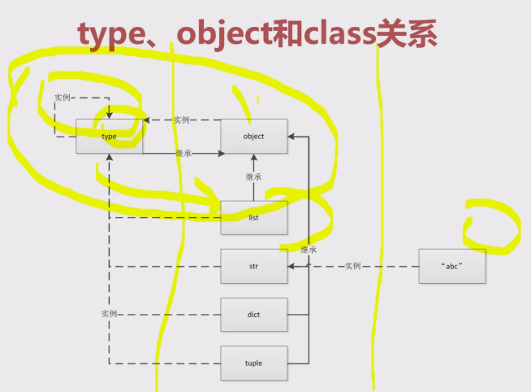

- Python一切皆对象
  - [type and class object](./Python一切皆对象/type_class_obj.py)
    - 
  - [python常见内置类型](./Python一切皆对象/python常见内置类型.py)
- Python魔法函数
  - [什么是魔法函数](./Python魔法函数/什么是魔法函数.py)
  - [python数据模型对python的影响](./Python魔法函数/python数据模型对python的影响.py)
  - [魔法函数一览](./Python魔法函数/魔法函数一览.py)
  - [魔法函数字符串表示](./Python魔法函数/魔法函数字符串表示.py)
  - [len方法](./Python魔法函数/len方法.py)
- 深入类和对象
  - [鸭子类型和多态](./Python深入类和对象/鸭子类型和多态.py)
  - [抽象基类](./Python深入类和对象/抽象基类.py)
  - [isinstance和type的区别](./Python深入类和对象/type_instance.py)
  - [类变量和实例变量](./Python深入类和对象/class_var.py)
  - [类和实例属性的查找顺序](./Python深入类和对象/类和实例属性的查找顺序_mro.py)
  - [类方法、静态方法和实例方法](./Python深入类和对象/class_method.py)
  - [数据封装和私有属性](./Python深入类和对象/private_method.py)
  - [python对象的自省机制](./Python深入类和对象/self_ex.py)
  - [super真的是调用父类吗？](./Python深入类和对象/super_test.py)
  - [mixin继承案例-django_rest_framework中对多继承使用的经验](./Python深入类和对象/mixin简单讲解.py)
  - [Pyhon中的with语句](./Python深入类和对象/with_test.py)
  - [contextlib简化上下文管理器](./Python深入类和对象/contextlib_with.py)
- 自定义序列类
  - [collections模块学习]
    - [collections概述](./Python自定义序列类/collections模块/CollectionOverview.py)
    - [collections-tuple讲解](./Python自定义序列类/collections模块/collections_tuple.py)
    - [namedtuple功能详解](./Python自定义序列类/collections模块/namedtuple_test.py)
    - [defaultdict功能详解](./Python自定义序列类/collections模块/defaultdict_test.py)
    - [deque功能详解](./Python自定义序列类/collections模块/deque_test.py)
  - [Python中的序列分类](./Python自定义序列类/Python中的序列分类.py)