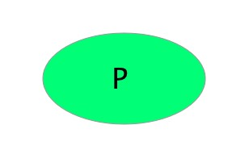
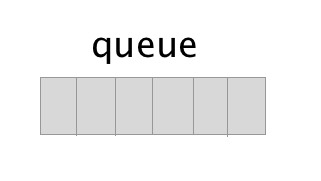

简单说明：
假设你装好RabbitMQ运行在localhost，端口默认的是5672，
如果你使用不一样的，那么需要调整。
## Tutorial 1------Hello World
RabbitMQ是一个消息代理，它接收和发送消息。

你可以把它想象成一个邮局，比如你想要寄信，你会把信件放进邮箱，
你知道邮递员会帮你把它送到你希望的人。类比这个，那么RabbitMQ就是
邮局，邮递员，邮箱。

而RabbitMQ和邮局不同的是，它不处理纸张，它接收，存储和发送的是
一些二进制的数据，也就是我们的信息。

用术语来解释一下：
- *Producer*：发送者/生产者，发送消息的程序一般被称为生产者。

- *queue*：队列，这个就可以理解为RabbitMQ的邮箱，尽管消息经过RabbitMQ和你的应用程序，
但是消息只能被存储在队列里，一个队列的大小仅受主机的内存和磁盘的限制，可以把它理解为一个
较大的消息缓冲区。很多生产者可以往一个队列里发送消息，反过来，很多消费者也可以同时尝试
从一个队列里获得消息。

- *Consumer*：接受者/消费者，主要等待消息的程序是消费者。


**注意：**
代理，生产者，消费者可以不在一个主机上，事实上很多应用也确实如此。
一个应用也同时可以做生产者和消费者。

### 使用Python的Pika客户端工具
教程这部分我们会用python写两个程序

一个生产者发送一个简单消息和一个消费者接受消息然后打印出来，这个消息是“Hello World”。
下面这个图，P就是生产者，C是消费者，中间那个盒子就是队列--代表消费者的消息缓冲区。


总体设计如下：生产者将消息发送到名叫hello的队列，消费者将从队列里接收到消息。

然后使用pip安装pika

### Sending
第一个程序`send.py`是要发送单个信息到队列里，要做的第一件事是与
RabbitMQ的服务器建立连接。
```
import pika

connection = pika.BlockingConnection(pika.ConnectionParameters('localhost'))
channel = connection.channel()
```
现在连接好了本地机器也就是`localhost`作为代理。如果要连接其他的机器作为代理，
只需简单的在参数位置指定名字或者IP地址就行了。

下一步必须确认接收消息的队列是存在的，如果我们把消息发送给一个不存在队列，
那么RabbitMQ将会把消息丢掉。

现在创建一个叫`hello`的队列，使得消息可以传递进去：
```
channel.queue_declare(queue='hello')
```
现在已经准备好发送消息了，第一个消息将仅仅包含一个字符串“Hello World!”。
并且我们想把它发送到hello这个队列里。

在RabbitMQ中，一个消息不能直接的发送到队列里，它需要经过`exchange`这个东西。
但是我们现在不扩展`exchange`的细节，将会在Tutorial3中知道更多一些。

现在只需要知道如何通过一个空字符串使用默认的`exchange`标识。此时，
这个`exchange`是特殊的，它允许我们指出消息应该去的确切的队列是哪一个。
这里把**队列的名字（字符串）**赋值给`routing_key`这个参数。
```
channel.basic_publish(
    exchange='',
    routing_key='hello',
    body='Hello World!'
)
print("[x] Sent 'Hello World!'")
```
在退出程序之前，需要确保刷新了网络缓冲区，并且确认已将我们的消息传递到RabbitMQ。
我们可以通过关闭连接来实现。
```
connection.close()
```
#### 注意Sending不工作可能的原因
>也许是代理启动的时候没有足够的磁盘空间（默认它需要至少200MB空间）因此拒绝接收消息。
>可以检查代理的日志文件如果有必要的话可以减少这个限制。
>[在这里](https://www.rabbitmq.com/configure.html#config-items)你会知道
>如何设置`disk_free_limit`这个参数。

### Receiving

Our second program receive.py will receive messages from the queue and print them on the screen.

Again, first we need to connect to RabbitMQ server. The code responsible for connecting to Rabbit is the same as previously.

The next step, just like before, is to make sure that the queue exists. Creating a queue using queue_declare is idempotent ‒ we can run the command as many times as we like, and only one will be created.

