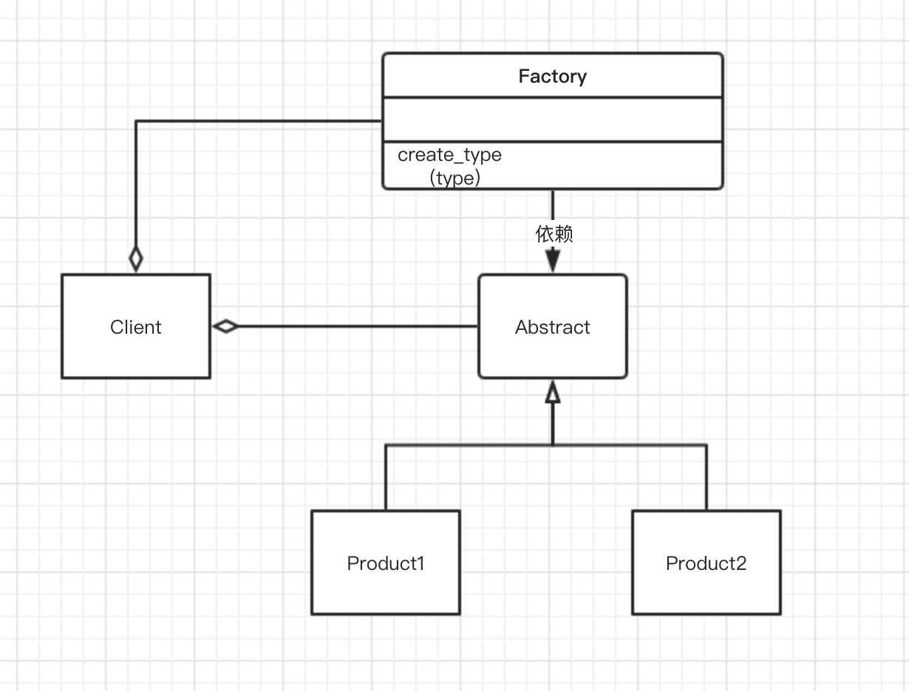
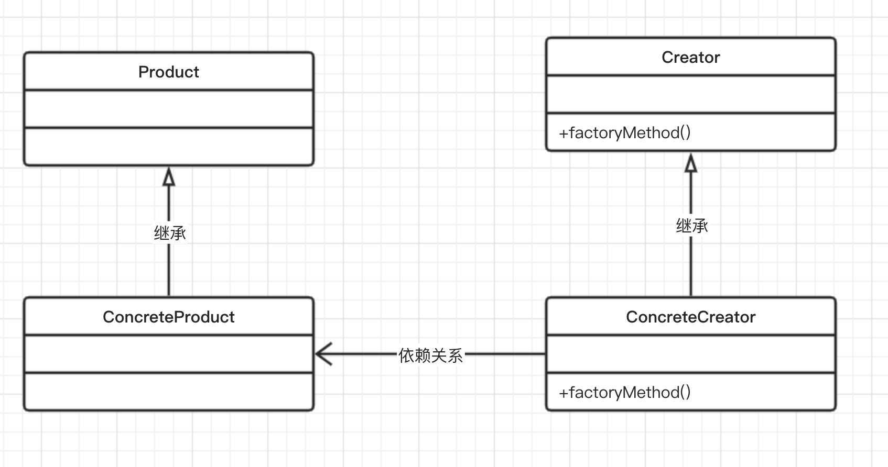
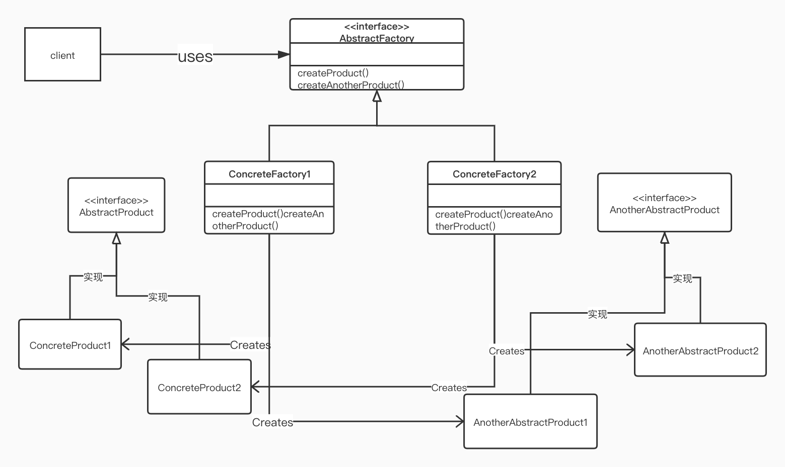

## 第三章 工厂模式：建立创建对象的工厂
这一章继续学洗另一种创建型模式，即工厂模式。
工厂模式可以说是最常用的设计模式。本章了解现实世界的应用场景以及
基于Python V3.8.0的实现。此外还会对工厂方法和抽象工厂方法进行比较。
简要介绍以下主题：
* 了解简单工厂设计模式
* 讨论工厂方法和抽象工厂方法及其差异
* 利用Python代码实现真实场景
* 讨论模式的优缺点并进行相应的比较

### 3.1 了解工厂模式
在面向对象编程中，术语“工厂”表示一个负责创建其他类型对象的类。

通常情况下，作为一个工厂的类有一个对象以及与它关联的多个方法。

客户端使用某些参数调用此方法，之后，工厂会据此创建所需类型的对象，
然后将它们返回给客户端。

所以，这里的问题实际上是，既然客户端可以直接创建对象，那为什么我们还需要
一个工厂呢？答案在于，工厂具有下列优点。
* 松耦合，即对象的创建可以独立于类的实现。
* 客户端无需了解创建对象的类，但是照样可以使用它来创建对象。它只需要知道
需要传递的接口、方法和参数，就能够创建所需类型的对象了。这简化了客户端的实现。
* 可以轻松地在工厂中添加其他类来创建其他类型的对象，而这无需更改客户端代码。
最简单的情况下，客户端只需要传递另一个参数就可以了。
* 工厂还可以重用现有对象。但是，如果客户端直接创建对象的话，总是创建一个新
对象。

让我们探讨制造玩具车或玩偶的公司的情况。假设公司里的一台机器目前正在制造玩具车。

后来，公司的CEO认为，迫切需要根据市场的需求来制造玩偶。这时，工厂模式就派上
用场了。

在这种情况下，机器成为接口，CEO是客户端。CEO只关心要制造的对象（或玩具）和创建
对象的接口--机器。

Factory模式有3种变体。
1. 简单工厂模式：允许接口创建对象，但不会暴露对象的创建逻辑。
2. 工厂方法模式：允许接口创建对象，但使用哪个类来创建对象，则是交由子类决定的。
3. 抽象工厂模式：抽象工厂是一个能够创建一系列相关的对象而无需指定\公开其具体类的接口。
该模式能够提供其他工厂的对象，在其内部创建其他对象。

### 3.2 简单工厂模式
对于一些人来说，简单工厂本身不是一种模式。开发人员在进一步了解这个概念之前，
首先需要详细了解工厂方法。工厂可以帮助开发人员创建不同类型的对象，
而不是直接将对象实例化。

uml图如下：


客户端使用的是Factory类，该类具有create_type()方法。当客户端使用类型参数
调用create_type()方法时，Factory会根据传入的参数，返回Product1还是Product2。

现在让我们用代码示例来进一步理解简单工厂模式。
在下面代码段中，我们将创建一个名为Animal的抽象产品。

Animal是一个抽象的基类（ABCMeta是一个Python的特殊元类，用来生成类Abstract），
它带有方法`do_say()`。我们利用Animal接口创建了两种产品(Cat和Dog)，并实现了
`do_say()`方法来提供这些动物的相应的叫声。

ForestFactory是一个带有make_sound()方法的工厂。根据客户端传递的参数类型，
它就可以在运行时创建适当的Animal实例，并输出正确的声音。
```
from abc import ABCMeta, abstractmethod
class Animal(metaclass = ABCMeta):
    @abstractmethod
    def do_say(self):
        pass

class Dog(Animal):
    def do_say(self):
        print("Bhow Bhow!!!!")

class Cat(Animal):
    def do_say(self):
        print("Meow Meow!!!!")

## forest factory defined
class ForestFactory(object):
    def make_sound(self, object_type):
        return eval(object_type)().do_say()

## client code
if __name__ == '__main__':
    ff = ForestFactory()
    animal = input("Which animal should make_sound Dog or Cat?")
    ff.make_sound(animal)
```
输出：
```
Which animal should make_sound Dog or Cat?Cat
Meow Meow!!!!
```
或者输出：
```
Which animal should make_sound Dog or Cat?Dog
Bhow Bhow!!!!
```
[代码版本：Python v3.8.0](../相关代码/第三章/3.2.py)
### 3.3 工厂方法模式
以下几点可以帮助我们了解工厂方法模式。
* 我们定义了一个接口来创建对象，但是工厂本身并不负责创建对象，
而是将这一任务交由子类来完成，即子类决定了要实例化哪些类。
* Factory方法的创建是通过继承而不是通过实例化来完成的。
* 工厂方法使设计更加具有可定制性。它可以返回相同的实例或子类，
而不是某种类型的对象（就像在简单工厂方法中的那样）。

uml图如下：


有一个包含factoryMethod()方法的抽象类Creator。
factoryMethod()方法负责创建指定类型的对象。

ConcreteCreator类提供了一个实现Creator抽象类的
factoryMethod()方法，这种方法可以在运行时修改已创建的对象。

ConcreteCreator创建ConcreteProduct，并确保其创建的对象实现了
Product类，同时为Product接口中的所有方法提供相应的实现。

简而言之，Creator接口的factoryMethod()方法和ConcreteCreator类
共同决定了要创建Product的哪个子类。因此，工厂方法模式定义了一个接口
来创建对象，但具体实例化哪个类则是它的子类决定的。
#### 3.3.1 实现工厂方法
让我们拿一个现实世界的场景来理解工厂方法的实现。

假设我们想在不同类型的社交网络（例如LinkedIn、Facebook等）上为个人或公司建立简介。
那么，每个简介都有某些特定的组成章节。

在LinkedIn的简介中，有一个章节是关于个人申请的专利或出版作品的。
在Facebook上，你将在相册中看到最近度假地点的照片区。
此外，在这两个简介中，都有一个个人信息的区。简而言之，
我们要通过将正确的区添加到相应的简介中来创建不同类型的简介。

下面来看具体实现。在下面代码示例中，首先定义接口Product。

我们将创建一个Section抽象类来定义一个区是关于哪方面内容的，让它尽量保持简单，
同时还提供一个抽象方法`description()`。
然后，我们会创建多个ConcreteProduct，PersonalSection、AlbumSection、
PatentSection和PublicationSection类。
这些类用于实现`describe()`抽象方法并打印它们各自的区名称。
```
from abc import ABCMeta, abstractmethod

# Product
class Section(metaclass = ABCMeta):
    @abstractmethod
    def describe(self):
        pass

# ConcreteProduct
class PersonalSection(Section):
    def describe(self):
        print("Personal Section!!!")

# ConcreteProduct
class AlbumSection(Section):
    def describe(self):
        print("Album Section!!!")

# ConcreteProduct
class PatentSection(Section):
    def describe(self):
        print("Patent Section!!!")

# ConcreteProduct
class PublicationSection(Section):
    def describe(self):
        print("Publication Section!!!")
```

我们创建了一个名为Profile的抽象类Creator。Profile[Creator]抽象类
提供了一个工厂方法，即`createProfile()`。
`createProfile()`方法应该由ConcreteCreator类来实现，
来实际创建带有适当区的简介。

Profile抽象类不知道每个简介应具有哪些区。例如，Facebook的简介应该
提供个人信息区和相册区。所以，我们将让子类决定这些事情。

我们创建了两个ConcreteCreator类，即linkedin和facebook。每个类都
实现createProfile()抽象方法，
由该方法在运行时创建（实例化）多个区（ConcreteProduct）：
```
# Creator
class Profile(metaclass=ABCMeta):
    def __init__(self):
        self.sections = []
        self.createProfile()
    @abstractmethod
    def createProfile(self):
        pass
    def getSections(self):
        return self.sections
    def addSections(self, section):
        self.sections.append(section)

# ConcreteCreator
class linkedin(Profile):
    def createProfile(self):
        self.addSections(PersonalSection())
        self.addSections(PatentSection())
        self.addSections(PublicationSection())

# ConcreteCreator
class facebook(Profile):
    def createProfile(self):
        self.addSections(PersonalSection())
        self.addSections(AlbumSection())
```
最后我们开始编写决定实例化哪个ConcreteCreator类的客户端代码，
以便让它根据指定的选项创建所需的简介：
```
# client
if __name__ == "__main__":
    profile_type = input("Which Profile you'd like to create? [LinkedIn or Facebook]")
    profile = eval(profile_type.lower())()
    print("Creating Profile...", type(profile).__name__)
    print("Profile has sections --", profile.getSections())
```
现在, 运行完整代码，它会首先要求输入要创建的简介名称。在以下输出示例中我们以
facebook为例。然后它实例化facebook[ConcreteCreator]类。
它会在内部创建ConcreteProduct，也就是说，将实例化PersonalSection和AlbumSection。
最后以上三段代码合起来会输出以下：
```
Which Profile you'd like to create? [LinkedIn or Facebook]facebook
Creating Profile... facebook
Profile has sections -- [<__main__.PersonalSection object at 0x100f53700>, <__main__.AlbumSection object at 0x100f53760>]
```
如果选择LinkedIn，则会创建PersonalSection、PatentSection和PublicationSection。
如下
```
Which Profile you'd like to create? [LinkedIn or Facebook]linkedin
Creating Profile... linkedin
Profile has sections -- [<__main__.PersonalSection object at 0x10aad0700>, <__main__.PatentSection object at 0x10aad0760>, <__main__.PublicationSection object at 0x10aad0730>]
```
[代码版本：Python v3.8.0](../相关代码/第三章/3.3.py)
#### 3.3.2 工厂方法模式的优点
* 它具有更大的灵活性，使得代码更加通用，因为它不是单纯地实例化某个类。
这样实现哪些类取决于接口（Product），而不是ConcreteProduct类。
* 它们是松耦合的，因为创建对象的代码与使用它的代码是分开的。
客户端完全不需要关心传递哪些参数以及需要实例化哪些类。
由于添加新类更加容易，所以降低了维护成本。
### 3.4 抽象工厂模式
抽象工厂模式的主要目的是提供一个接口来创建一系列相关对象，而无需指定具体的类。
工厂方法将创建实例的任务委托给了子类，而抽象工厂方法的目标是创建一系列相关对象。
如下UML图所示，ConcreteFactory1和ConcreteFactory2是通过AbstractFactory
接口创建的。此接口具有创建多种产品的相应方法。

ConcreteFactory1和ConcreteFactory2实现了AbstractFactory，并创建实例
ConcreteProduct1、ConcreteProduct2、AnotherConcreteProduct1和
AnotherConcreteProduct2。

在这里，ConcreteProduct1和ConcreteProduct2是通过AbstractProduct接口
创建的，而AnotherConcreteProduct1和AnotherConcreteProduct2则是通过
AnotherAbstractProduct接口创建的。

实际上抽象工厂模式不仅确保客户端与对象的创建相互隔离，同时还确保客户端能够使用创建的对象。
但是，客户端只能通过接口访问对象。

如果要使用一个系列中的多个产品，那么抽象工厂模式能够帮助客户端一次使用来自一个产品/系列的多个对象。
例如，如果正在开发的应用应该是平台无关的，则它需要对各种依赖项进行抽象处理，
这些依赖项包括操作系统、文件系统调用，等等。抽象工厂模式负责为整个平台创建所需的服务，
这样的话，客户端就不必直接创建平台对象了。
#### 实现抽象工厂模式
设想一下你最喜欢的披萨店的情况。它提供多种披萨饼，对吧？
现在想象一下，我们开办了一家披萨店，供应美味的印式和美式披萨饼。

为此我们首先创建一个抽象基类--PizzaFactory（AbstractFactory，见前面UML图）。
PizzaFactory类有两个抽象方法即`createVegPizza()`和`createNonVegPizza()`，
它们需要通过ConcreteFactory实现。在这个例子中，我们创造了两个具体的工厂，分别命名为
IndianpizzaFactory和USPizzaFactory。下面看看这两个具体工厂的实现代码：
```
from abc import ABCMeta, abstractmethod

# AbstractFactory
class PizzaFactory(metaclass=ABCMeta):
    @abstractmethod
    def createVegPizza(self):
        pass

    @abstractmethod
    def createNonVegPizza(self):
        pass

# ConcreteFactory1
class IndianPizzaFactory(PizzaFactory):
    def createVegPizza(self):
        return DeluxVeggiePizza()
    def createNonVegPizza(self):
        return ChickenPizza()

# ConcreteFactory2
class USPizzaFactory(PizzaFactory):
    def createVegPizza(self):
        return MexicanVegPizza()
    def createNonVegPizza(self):
        return HamPizza()
```
现在让我们进一步定义AbstractProducts。在下面的代码中，我们将创建两个抽象类：
VegPizza和NonVegPizza(AbstractProduct和AnotherAbstractProduct见前面的UML图)。
它们都定义了自己的方法，分别是prepare()和serve()。

这里的想法是，素食披萨饼配有适当的外皮、蔬菜和调味料，非素食披萨饼在素食披萨并上面搭配非素食食材。

然后我们为每个AbstractProducts定义ConcreteProducts。现在，就本例而言，我们将创建
DeluxVeggiePizza和MexicanVegPizza，并事项prepare()方法。
ConcreteProduct1和ConcreteProduct2将代表UML图中的这些类。

接下来，我们来定义ChickenPizza和HamPizza，并实现serve()方法--它们代表
AnotherConcreteProduct1和AnotherConcreteProduct2:
```
# AbtractProduct
class VegPizza(metaclass=ABCMeta):
    @abstractmethod
    def prepare(self, VegPizza):
        pass

# AnotherAbstractProduct
class NonVegPizza(metaclass=ABCMeta):
    @abstractmethod
    def serve(self, VegPizza):
        pass

# ConcreteProduct1
class DeluxVeggiePizza(VegPizza):
    def prepare(self):
        print("Prepare ", type(self).__name__)

# ConcreteProduct2
class MexicanVegPizza(VegPizza):
    def prepare(self):
        print("Prepare ", type(self).__name__)

# AnotherConcreteProduct1
class ChickenPizza(NonVegPizza):
    def serve(self, VegPizza):
        print(type(self).__name__, "is served with Chicken on ", type(VegPizza).__name__)

# AnotherConcreteProduct2
class HamPizza(NonVegPizza):
    def serve(self, VegPizza):
        print(type(self).__name__, "is served with Ham on ", type(VegPizza).__name__)
```
当最终用户来到PizzaStore并要一份美式非素食披萨的时候，USPizzaFactory负责准备素食，
然后在上面加上火腿，马上就变成非素食披萨了！
```
# use
class PizzaStore:
    def __init__(self):
        pass
    def makePizzas(self):
        for factory in [IndianPizzaFactory(), USPizzaFactory()]:
            self.factory = factory
            self.NonVegPizza = self.factory.createNonVegPizza()
            self.VegPizza = self.factory.createVegPizza()
            self.VegPizza.prepare()
            self.NonVegPizza.serve(self.VegPizza)

pizza = PizzaStore()
pizza.makePizzas()
```
输出如下：
```
Prepare  DeluxVeggiePizza
ChickenPizza is served with Chicken on  DeluxVeggiePizza
Prepare  MexicanVegPizza
HamPizza is served with Ham on  MexicanVegPizza
```
[代码版本：Python v3.8.0](../相关代码/第三章/3.4.py)
### 3.5 工厂方法与抽象工厂方法
比较二者：
|工厂方法|抽象工厂方法|
|:-:|:-:|
它向客户端开放了一个创建对象的方法|抽象工厂方法包含一个或多个工厂方法来创建一个系列的相关对象
它使用继承和子类来决定要创建哪个对象|它使用组合将创建对象的任务委托给其他类
工厂方法用于创建一个产品|抽象工厂方法用于创建相关产品的系列
### 小结
* 简单工厂模式：它可以在运行时根据客户端传入的参数类型来创建相应的实例。
* 工厂方法模式：他是简单工厂的一个变体。在这种模式中，我们定义了一个接口来创建对象，
但是对象的创建却是交由子类完成的。
* 抽象工厂方法模式：它提供了一个接口，无需指定具体的类型就可以创建一系列的相关对象。