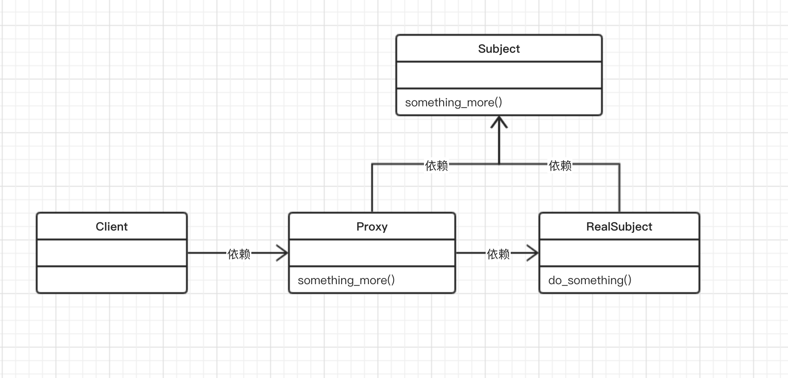

## 第五章 代理模式--控制对象的访问
本章进一步学习结构型设计模式中的代理模式。我们讨论一下主题：
* 介绍代理和代理设计模式
* 代理模式的UML
* 代理模式的变体
* 代码实现真实示例
* 代理模式的优点
* 门面模式和代理模式之间的比较
* 常见问答

### 5.1 理解代理设计模式
代理通常就是一个介于寻求方和提供方之间的中介系统。
寻求方是发出请求的一方，而提供方则是根据请求提供资源的一方。
在Web世界中，它相当于代理服务器。

客户端（万维网中的用户）在向网站发出请求时，首先连接到代理服务器，
然后向它请求诸如网页之类的资源。代理服务器在内部评估此请求，将其发送到适当的服务器，
当它收到响应后，就会将响应传递给客户端。

因此，代理服务器可以封装请求、保护隐私，并且非常适合在分布式架构中运行。

在设计模式的上下文中，代理是充当实际对象接口的类。对象类型可以是多样化的，
例如网络连接、内存和文件中的大对象，等等。

简而言之，代理就是封装实际服务对象的包装器或代理人。
代理可以为其包装的对象提供附加功能，而无需更改对象的代码。
代理模式的主要目的是为其他对象提供一个代理者或占位符，从而控制对实际对象的访问。

代理模式可以用于多种场景：
* 它能够以更简单的方式表示一个复杂的系统。例如，涉及多个复杂计算或过程的系统
应该提供一个更简单的接口，让它充当客户端的代理。
* 它提高了现有的时间对象的安全性。在许多情况下，都不允许客户端直接访问实际对象。
这是因为实际对象可能受到恶意活动的危害。这时候，代理就能起到抵御恶意活动的盾牌作用，
从而保护了实际的对象。
* 它为不同的服务器上的远程对象提供本地接口。一个明显的例子是客户端希望在远程系统上
运行某些命令的分布式系统，但客户端可能没有直接的权限来实现这一点。
因此它将请求转交给本地对象（代理），然后由远程机器上的代理执行该请求。
* 它为消耗大量内存的对象提供了一个轻量级的句柄。有时，你可能不想加载主要对象，
除非它们真的有必要。这是因为实际对象真的很笨重，可能需要消耗大量资源。
一个典型的例子是网站用户的个人简介头像。你最好在列表视图中显示头像的缩略图，当然，
为了展示用户简介的详细介绍，你就需要加载实际图片了。

让我们通过一个简单例子来理解该模式。不妨以演员与他的经纪人为例，当制作公司想要找
演员拍电影时，它们通常会与经纪人交流，而不是直接跟演员交流。经纪人会根据演员的
日程安排和其他合约情况，来答复制作公司该演员是否有空，以及是否对该影片感兴趣。
在这种情况下，制作公司并不直接找演员交涉，而是通过经纪人作为代理，处理所有与
演员有关的调度和片酬问题。

下面的Python代码实现了这种场景，其中Agent是代理。对象Agent查看Actor是否
正处于忙碌状态。如果Actor正忙，则调用`Actor().occupied()`方法；如果
Actor不忙，则返回`Actor().available()`方法。
```
class Actor(object):
    def __init__(self):
        self.isBusy = False
    
    def occupied(self):
        self.isBusy = True
        print(type(self).__name__, "is occupied with current movie")
    
    def available(self):
        self.isBusy = False
        print(type(self).__name__, "is free for the movie")
    
    def getStatus(self):
        return self.isBusy

class Agent(object):
    def __init__(self):
        self.principal = None
    
    def work(self):
        self.actor = Actor()
        if self.actor.getStatus():
            self.actor.occupied()
        else:
            self.actor.available()

if __name__ == "__main__":
    r = Agent()
    r.work()
```
[代码版本：Python v3.8.0](../相关代码/第五章/5.1.py)

代理设计模式主要完成了一下工作：
* 它为其他对象提供了一个代理，从而实现了对原始对象的访问控制。
* 它可以用作一个层或者接口，以支持分布式访问。
* 它通过增加代理，保护真正的组件不受意外的影响。


### 5.2 代理模式的UML类图
现在我们可以借助于下面的UML类图来探讨代理模式。正如我们在上一节中所介绍的那样，
代理模式有三个主要角色：制作公司、经纪人和演员。

下面让我们把这些角色放入一个UML图中，看看这些类如何关联：

观察这个UML类图，可以发现这个模式有下述3个主要参与者。
* **代理**：它维护一个引用，允许代理（Proxy）通过这个引用来访问实际对象。
它提供了一个与主题（Subject）相同的接口，以便代理可以替换真实的主题。
代理还负责创建和删除真实主题（RealSubject)。
* **主题**：它定义了RealSubject和Proxy的公共接口。以Proxy和RealSubject
的形式实现主题（Subject），使用RealSubject的任何地方都可以使用代理（Proxy）。
* **真实主题**：它定义代理（Proxy）所代表的的真实对象。

从*数据结构*的角度来看，UML图可以表示如下：
* **代理**：它是一个控制对RealSubject类访问的类。它处理客户端的请求，
负责创建或删除RealSubject。
* **主题/真实主题**：主题是定义真实主题（RealSubject）和代理（Proxy)
相类似的接口。Proxy是Subject接口的实际实现，并且是访问了RealSubject的某些方法实现的。
它提供了真正的功能，然后由客户端使用。
* **客户端**：它访问要完成工作的Proxy类。Proxy在内部控制对RealSubject的访问，
并引导客户端（Client）所请求的工作。

### 5.3 了解不同类型的代理
在许多常见的情形中，都会用到代理。在本章开头部分，我们已经对部分情形进行了讨论。
根据代理的使用方式，我们可以将它们分为虚拟代理、远程代理、保护代理和智能代理。

#### 5.3.1 虚拟代理
如果一个对象实例化后会占用大量内存的话，可以先利用占位符来表示，这就是所谓的虚拟代理。
例如，你想在网上加载大型图片，而这个请求需要很长时间才能加载完成。
通常，开发人员将在网页上创建一个占位符图标，以提示这里有图像。
但是，只有当用户实际点击图标时才会加载图像，从而节省了向存储器中加载大型图像的开销。
因此，在虚拟代理中，当客户端请求或访问对象时，才会创建实际对象。

#### 5.3.2 远程代理
远程代理可表述如下：
它给位于远程服务器或不同地址空间上的实际对象提供了一个本地表示。
例如，你希望为应用程序建立一个监控系统，而该应用涉及多个Web服务器、数据库服务器、
（Celery）任务服务器、缓存服务器，等等。
如果我们要见识这些服务器的CPU和磁盘利用率，就需要建立一个对象，
该对象能够用于监视应用程序运行的上下文中，同时还可以执行远程命令以获取实际的参数值。
在这种情况下，建立一个作为远程对象的本地表示的远程代理对象将可以帮助我们实现这个目标。

#### 5.3.3 保护代理
这种代理能够控制RealSubject的敏感对象的访问。例如，在当今分布式系统的世界中，
Web应用会提供多个服务，这些服务相互协作来提供各种功能。现在，在这样的系统中，
认证服务充当负责认证和授权的保护性代理服务器。在这种情况下，代理自然有助于
保护网站的核心功能，防止无法识别或未授权的代理访问它们。
因此，代理对象会检查调用者是否具有转发请求所需的访问权限。

#### 5.3.4 智能代理
智能代理在访问对象时插入其他操作。例如，假设在系统中有一个核心组件，它将状态信息
集中保存在一个地点。通常情况下，这样的组件需要被多个不同的服务调用以完成他们的任务，
并且可能导致共享资源的问题。与让服务直接调用核心组件不同，智能代理是内置的，
并且会在访问之前检查实际对象是否被锁定，以确保没有其他对象可以更改它。

### 5.4 现实世界中的代理模式
我们将通过付款用例来展示代理模式的显示应用场景。

让我们假设，你在商场溜达，看中了一件牛仔衫，你想买，现金却不够了。
要是在不久以前，你可以去ATM取钱，然后来到商场付款。在更早的时候，
通常使用的是银行支票，这样你就必须去银行提款，然后再回商场付款。

得益于银行业务的发展，后来出现了一种称为借记卡的东西。所以现在，
你买东西的时候，只要在商家刷一下借记卡，这笔钱就会划入商家账户，从而完成支付。

下面我们利用Python来开发一个应用程序，实现上述示例。

首先从客户端开始：
你去了商场，现在想买一件漂亮的牛仔衫。让我们看看如何编写客户端代码。
* 你的行为由类You（即客户端）来表示。
* 为了购买衬衫，该类提供了`make_payment()`方法。
* 特殊方法`__init__()`会调用代理并将其实例化。
* `make_payment()`方法在内部调用代理的方法进行付款。
* 如果付款成功，将返回`__del__()`方法。
因此，代码示例如下所示：
```
class You:
    def __init__(self):
        print("You::Lets buy the Denim shirt")
        self.debitCard = DebitCard()
        self.isPurchased = None
    
    def make_payment(self):
        self.isPurchased = self.debitCard.do_pay()
    
    def __del__(self):
        if self.isPurchased:
            print("You:: Wow! Denim shirt is Mine :-)")
        else:
            print("You:: I should earn more :(")

you = You()
you.make_payment()
```
现在让我们讨论一下主题。主题是由代理和真实主题实现的接口。
* 在这个例子中，主题是Payment类。它是一个抽象基类，代表一个接口。
* 付款具有一个`do_pay()`方法，该方法需要借助代理和真实主题来实现。
下面通过具体代码来考察这些方法：
```
from abc import ABCMeta, abstractmethod

class Payment(metaclass=ABCMeta):
    @abstractmethod
    def do_pay(self):
        pass
```
在这个场景中，我们还开发了代表真实主题的Bank类：
* Bank实际完成从你的账户向商家账户划账的工作。
* Bank提供了多少个方法来处理付款。代理使用`setCard()`方法将借记卡详细信息发送给银行。
* `__getAccount()`方法是Bank的私有方法，用于获取借记卡持有人的账户详细信息。
* Bank还有`__hasFunds()`方法，它用来查看账户持有人在账户中是否有足够的资金来为衬衫付款。
* 由Bank类（通过Payment接口）实现的`do_pay()`方法实际上负责根据可用资金向商家付款
```
class Bank(Payment):
    def __init__(self):
        self.card = None
        self.account = None

    def __getAccount(self):
        self.account = self.card  # Assume card number is account number
        return self.account
    
    def __hasFunds(self):
        print("Bank:: Checking if Account", self.__getAccount(), "has enough funds")
        return True
    
    def setCard(self, card):
        self.card = card
    
    def do_pay(self):
        if self.__hasFunds:
            print("Bank:: Paying the merchant")
            return True
        else:
            print("Bank:: Sorry, not enough funds!")
            return False
```
让我们现在来理解最后一部分，即与代理有关的部分。
* DebitCard类是此处的代理。当你想要付款时，它会调用`do_pay()`方法。
这是因为你不想跑去银行提款，然后再跑回商家完成支付。
* DebitCard类充当真实主题（银行）的代理。
* `payWithCard()`方法在内部控制真实主题（Bank类）对象的创建，并向
银行提供借记卡的详细信息。
* Bank在内部对账户进行检查并完成支付，具体代码如下。
```
class DebitCard(Payment):
    def __init__(self):
        self.bank = Bank()
    
    def do_pay(self):
        card = input("Proxy:: Punch in Card Number: ")
        self.bank.setCard(card)
        return self.bank.do_pay()
```
账户为正数时，即资金够用时，输出如下：
```
You::Lets buy the Denim shirt
Proxy:: Punch in Card Number: 1234567890
Bank:: Checking if Account 1234567890 has enough funds
Bank:: Paying the merchant
You:: Wow! Denim shirt is Mine :-)
```
账户为负数时，即资金不够时，输入如下：
```
You::Lets buy the Denim shirt
Proxy:: Punch in Card Number: 1234567890
Bank:: Checking if Account 1234567890 has enough funds
Bank:: Sorry, not enough funds!
You:: I should earn more :(
```
[代码版本：Python v3.8.0](../相关代码/第五章/5.4.py)
### 5.5 代理模式的优点
我们已经学习了代理模式在现实世界中的工作原理，接下来让我们了解一下
代理模式的优点。
* 代理可以通过缓存笨重的对象或频繁访问的对象来提高应用程序的性能。
* 代理还提供对于真实主题的访问授权。因此，只有提供合适权限的情况下，这个模式才会接受委派。
* 远程代理还便于与可用作网络连接和数据库连接的远程服务器进行交互，并可用于监视系统。
### 5.6 门面模式和代理模式之间的比较
它们俩都是结构型设计模式。
它们的相似之处在于，都是在真实对象的前面加入一个代理/门面对象。
但是在意图或目的方面，这两种模式的确存在差异，具体如下：

代理模式|门面模式
-:|:-
它为其他对象提供了代理或占位符，以控制对原始对象的访问|它为类的大型子系统提供了一个接口
代理对象具有与其目标对象相同的接口，并保存有目标对象的引用|它实现了子系统之间的通信和依赖性的最小化
它充当客户端和被封装的对象之间的中介|门面对象提供了单一的简单接口

### 5.7 常见问答
Q1. 装饰器模式和代理模式之间有什么区别？

A：装饰器向在运行时装饰的对象添加行为，而代理则是控制对对象的访问。代理和真实主题之间的
关联是在编译时完成的，而不是动态的。

Q2. 代理模式的缺点是什么？

A：代理模式会增加响应时间。例如，如果代理没有良好的体系结构或存在性能问题，它就会增加真实
主题的相应时间。一般来说，这一切都取决于代理写得有多好。

Q3. 客户端可以独立访问真实主题吗？

A：是的，但是代理模式能够提供许多优势，例如虚拟、远程等，所以使用代理模式会更好一些。

Q4. 代理是否能给自己添加任何功能？

A：代理可以向真实主题添加额外的功能，而无需更改对象的代码。代理和真实主题可以实现相同的接口。


