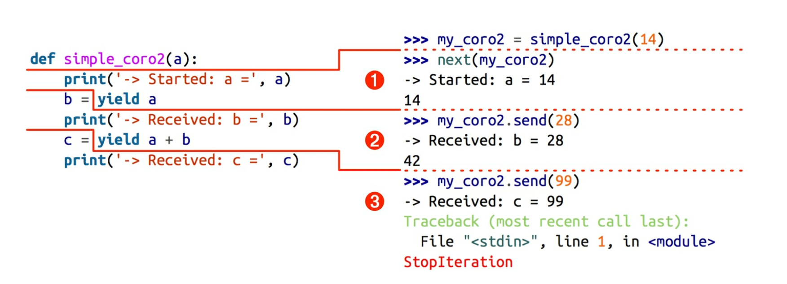

<!--
 * @Author: 27
 * @LastEditors: 27
 * @Date: 2020-04-02 00:04:11
 * @LastEditTime: 2020-04-02 00:04:11
 * @FilePath: /Coding-Daily/content/Python_Generate/python语言总结回顾/协程（流畅的python学习）/协程学习.md
 * @description: type some description
 -->
## 16.1 生成器如何进化成协程
`yield`关键字可以在表达式中使用，而且生成器 API 中增加了`.send(value)`方法。
生成器的调用 方可以使用`.send(...)`方法发送数据，发送的数据会成为生成器函数中`yield`表达式的值。
因此，生成器可以作为协程使用。

*协程是指一个过程，这个过程与调用方协作，产出由调用方提供的值。*

除了`.send(...)`方法，PEP 342 还添加了`.throw(...)`和`.close()`方法:
前者的作用是让调用方抛出异常，在生成器中处理;后者的作用是终止生成器。

**PEP 380** 对生成器函数的句法做了两处改动，以便更好地作为协程使用。
- 现在，生成器可以返回一个值;以前，如果在生成器中给`return`语句提供值，会抛出`SyntaxError`异常。
- 新引入了`yield from`句法，使用它可以把复杂的生成器重构成小型的嵌套生成器，省去了之前把生成器的工作委托给子生成器所需的大量样板代码。

## 16.2 用作协程的生成器的基本行为
```
def simple_coroutine():  # 协程使用生成器函数定义:定义体中有 yield 关键字。
    print('-> coroutine started')
    x = yield  # 如果协程只从客户那里接收数据，那么产出的值是None，这个值是隐式指定的，因为yield关键字右边没有表达式
    print('-> coroutine received:', x)


my_coro = simple_coroutine()  # 调用函数得到生成器对象
print(my_coro)  # <generator object simple_coroutine at 0x1012956d0>
next(my_coro)   # 因为生成器还没启动，没在yield处暂停，所以一开始无法发送数据。
my_coro.send(42)    # 调用这个方法后，协程定义体中的yield会计算出42，现在，协程会恢复，一直运行到下一个yield表达式，或者终止。
# 然后控制权流动到协程定义体的末尾，导致协程生成器向往常一样抛出StopIteration异常。
```
输出：
```
<generator object simple_coroutine at 0x10a1af6d0>
-> coroutine started
-> coroutine received: 42
Traceback (most recent call last):
  File "/Users/fzk27/fzk27/Coding-Daily/content/Python_Generate/python语言总结回顾/协程（流畅的python学习）/16-2.py", line 16, in <module>
    my_coro.send(42)    # 调用这个方法后，协程定义体中的yield会计算出42，现在，协程会恢复，一直运行到下一个yield表达式，或者终止。
StopIteration
```
顺序可能有点儿不太一样，比如类似这样：
```
Traceback (most recent call last):
<generator object simple_coroutine at 0x10a1af6d0>
  File "/Users/fzk27/fzk27/Coding-Daily/content/Python_Generate/python语言总结回顾/协程（流畅的python学习）/16-2.py", line 16, in <module>
-> coroutine started
-> coroutine received: 42
    my_coro.send(42)    # 调用这个方法后，协程定义体中的yield会计算出42，现在，协程会恢复，一直运行到下一个yield表达式，或者终止。
StopIteration
```
协程可以身处四个状态中的一个。当前状态可以使用 inspect.getgeneratorstate(...) 函数确定，该函数会返回下述字 符串中的一个。
- 'GEN_CREATED'，等待开始执行。
- 'GEN_RUNNING'，解释器正在执行。
>只有在多线程应用中才能看到这个状态。此外，生成器对象在自己身上调用getgeneratorstate 函数也行，不过这样做没什么用。

- 'GEN_SUSPENDED'，在 yield 表达式处暂停。 
- 'GEN_CLOSED'，执行结束。

因为`send`方法的参数会成为暂停的`yield`表达式的值，所以，仅当协程处于暂停状态时才能调用`send`方法**传值**，例如`my_coro.send(42)`。
不过，如果协程还没激活(即状态是'GEN_CREATED')，情况就不同了。
因此，始终要调用`next(my_coro)`激活协程——也可以调用`my_coro.send(None)`，效果一样。

如果创建协程对象后立即把 None 之外的值发给它，会出现下述错误:
```
>>> my_coro = simple_coroutine() 
>>> my_coro.send(1729)
Traceback (most recent call last):
File "<stdin>", line 1, in <module>
TypeError: can't send non-None value to a just-started generator
```
不能把非空的值传给刚建立好的生成器。

最先调用`next(my_coro)`函数这一步通常称为“预激”(prime)协程，
(即，让协程向前执行到第一个 yield 表达式，准备好作为活跃的协程使用)。

[上述示例源代码 ------> simple_coroutine](./16-2.py)

再来个产出两个值的协程：
```
def simple_coro2(a):
    print("-> Started: a =", a)
    b = yield a
    print("-> Received: b =", b)
    c = yield a + b
    print("-> Received: c =", c)

my_coro2 = simple_coro2(14)
from inspect import getgeneratorstate
print(getgeneratorstate(my_coro2))      # 处于GEN_CREATED状态，协程未启动
print(next(my_coro2))     # 预激协程，执行到第一个yield表达式，打印 -> Started: a = 14，然后产出a值，并且暂停等待为b赋值
print(getgeneratorstate(my_coro2))  # 处于GEN_SUSPENDED状态，即协程在yield表达式处暂停
print(my_coro2.send(28))        # 把数字28发给协程，计算yield表达式，得到28，然后赋值给b，打印 -> Received: b = 28消息，产出a+b的值42，然后协程暂停，等待为c赋值
try:
    print(my_coro2.send(99))    # 把数字99发给协程，计算yield表达式，得到99，然后赋值给c，打印 -> Received: c = 99消息，然后协程终止，产生StopIteration异常被texcept捕捉
except StopIteration as e:
    print("StopIteration!!!")   # 捕捉到StopIteration异常。
finally:
    print(getgeneratorstate(my_coro2))  # 可以清晰的看到抛出StopIteration后协程处于GEN_CLOSED状态（即协程执行结束）
```
输出为：
```
GEN_CREATED

-> Started: a = 14
14
GEN_SUSPENDED

-> Received: b = 28
42

-> Received: c = 99
StopIteration!!!

GEN_CLOSED
```
关键点是，协程在yield关键字所在的位置暂停执行。

也就是在赋值语句中，= 右边的代码在赋值前（send进值之前，排除掉函数传进参数的情况）执行，
因此对于`b = yield a`这行代码来说，等到客户端代码再激活协程时才会设定b的值。

这种行为要花点时间才能习惯，不过一定要理解，这样才能弄懂异步编程中yield的作用。

simple_coro2协程的执行过程分为三个阶段，如图：

1. 调用`next(my_coro2)`，打印第一个消息，然后执行`yield a`，产出数字14。
2. 调用`my_coro2.send(28)`，把28赋值给b，打印第二个消息，然后执行`yield a+b`，产出数字42
3. 调用`my_coro2.send(99)`，把99赋值给c，打印第三个消息，协程遇见StopIteration，终止。
> 各个阶段都在yield表达式处结束，而下一个阶段都从那一行代码开始，然后再把yield表达式的值赋给变量。

[上述示例源代码 ------> simple_coro2](./16-3.py)


## 16.3 示例：使用协程计算移动平均值


