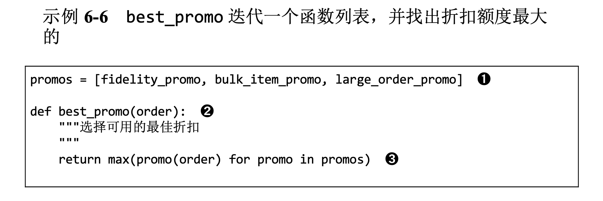
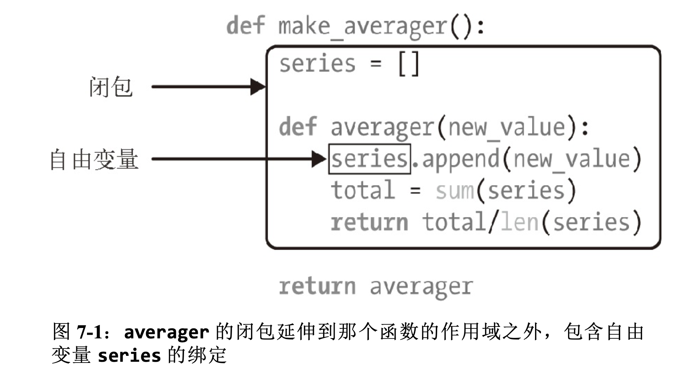

<!--
 * @Author: 27
 * @LastEditors: 27
 * @Date: 2020-04-02 03:29:50
 * @LastEditTime: 2020-04-02 03:29:50
 * @FilePath: /Coding-Daily/content/Python_Generate/python语言总结回顾/装饰器和闭包（流畅的python学习）/装饰器闭包学习.md
 * @description: type some description
 -->
## 7.1 装饰器基础知识
装饰器是可调用的对象，其参数是另一个函数(被装饰的函数)。
装饰器可能会处理被装饰的函数，然后把它返回，或者将其替换成另一个函数或可调用对象。

假如有个名为`decorate`的装饰器:
```
@decorate 
def target():
    print('running target()')
```
上述代码的效果与下述写法一样:
```
def target():
    print('running target()')
target = decorate(target)
```
两种写法的最终结果一样:
上述两个代码片段执行完毕后得到的`target`不一定是原来那个`target`函数，而是`decorate(target)`返回的函数。
为了确认被装饰的函数会被替换，请看示例:
```
def deco(func):
    def inner():
        print("running inner()")

    return inner  # 返回inner函数对象


@deco  # 使用deco装饰target函数
def target():
    print("running target()")


target()        # 调用被装饰的target其实会运行inner
print(target)   # 查看对象，target现在是inner的引用
```
输出：
```
running inner()
<function deco.<locals>.inner at 0x10cd798b0>
```
严格来说，装饰器只是语法糖。如前所示，装饰器可以像常规的可调用对象那样调用，其参数是另一个函数。
有时，这样做更方便，尤其是做元编程(在运行时改变程序的行为)时。综上，装饰器的两个特性是：
- 能把被装饰的函数替换成其他函数。
- 装饰器在加载模块时立即执行。

[上述示例源代码 ------> deco](./7-1.py)

## 7.2 Python何时执行装饰器
装饰器的一个关键特性是，它们在被装饰函数定义之后立即运行。这通常是在导入时（即python加载模块时）。
请看示例
```registration.py
registry = []       # 保存被@register装饰的函数引用

def register(func):     # register的参数是一个函数
    print("running register(%s)" % func)     # 打印被装饰的函数
    registry.append(func)       # 把被装饰的函数装入registry
    return func         # 返回函数，必须返回函数，这里返回的函数与通过参数传入的一样。

@register       # f1、f2被@register装饰
def f1():
    print("running f1()")

@register
def f2():
    print("running f2()")

def f3():       # f3没有被装饰
    print("running f3()")

def main():     # main显示registry，然后调用f1()、f2()、f3()
    print("running main()")
    print("registry ->", registry)
    f1()
    f2()
    f3()

if __name__ == '__main__':      # 只有把本py文件当做脚本运行时才调用main()
    main()
```
输出：
```
running register(<function f1 at 0x10954b8b0>)
running register(<function f2 at 0x10954b790>)
running main()
registry -> [<function f1 at 0x10954b8b0>, <function f2 at 0x10954b790>]
running f1()
running f2()
running f3()
```
注意register在模块中其他函数之前运行（两次）。调用register时，传给它的参数是被装饰的函数。
例如：<function f1 at 0x10954b8b0>

加载模块后，registry中有两个被装饰函数的引用：f1和f2。
这两个函数和f3只在main明确调用它们时才执行。

如果只导入这个模块，即不作为脚本运行，那么会输出以下：
```只导入
running register(<function f1 at 0x1104ff820>)
running register(<function f2 at 0x1104ff8b0>)
```
此时查看registry的值：
```
[<function f1 at 0x1094fe820>, <function f2 at 0x1094fe8b0>]
```
[上述示例源代码 ------> registration](./7-2.py)

所以这个示例说明，函数装饰器再导入模块时立即执行，而被装饰的函数只在明确调用时运行。
这也突出了python程序员所关注的导入时和运行时的区别。

考虑到装饰器在真实代码中的常用方式，示例有两个不寻常的地方：
- 装饰器函数与被装饰的函数在同一个模块中定义。但实际情况是，装饰器通常在一个模块中定义，然后应用到其他模块中的函数上。
- `register`装饰器返回的函数与通过参数传入的相同。实际上，大多数装饰器会在内部定义一个函数，然后将其返回。

虽然示例中的`register`装饰器原封不动地返回被装饰的函数，但是这种技术并非没有用处。
很多Python Web框架使用这样的装饰器把函数添加到某种中央注册处，例如把 URL 模式映射到生成 HTTP 响应的函数上的注册处。
这种**注册装饰器**可能会也可能不会修改被装饰的函数。

## 7.3 使用装饰器改进"策略"模式
回顾一下，示例 6-6 ：

它的主要问题是，定义体中有函数的名称，但是 best_promo 用来判断哪个折扣幅度最大的 promos 列表中也有函数名称。
这种重复是个问题，因为新增策略函数后可能会忘记把它添加到 promos 列表中，导致 best_promo 忽略新策略，而且不报错，
为系统引入了不易察觉的缺陷。
下面的示例使用注册装饰器解决了这个问题。电商促销折扣示例：
```promotion.py
promos = []  # promos 列表起初是空的。

def promotion(promo_func):  # promotion 把 promo_func 添加到 promos 列表中，然后原封不动地将其返回。
    promos.append(promo_func)
    return promo_func

@promotion  # 被 @promotion 装饰的函数都会添加到 promos 列表中。
def fidelity(order):
    '''为积分为1000或以上的顾客提供5%的折扣'''
    return order.total() * .05 if order.customer.fidelity >= 1000 else 0

@promotion
def bulk_item(order):
    """单个商品为20个或以上时提供10%折扣"""
    discount = 0
    for item in order.cart:
        if item.quantity >= 20:
            discount += item.total() * .1
    return discount

@promotion
def large_order(order):
    """订单中的不同商品达到10个或以上时提供7%折扣"""
    distinct_items = {item.product for item in order.cart}
    if len(distinct_items) >= 10:
        return order.total() * .07
    return 0

def best_promo(order):  # best_promos 无需修改，因为它依赖 promos 列表。
    """选择可用的最佳折扣"""
    return max(promo(order) for promo in promos)
```
这个方案有几个优点：
- @promotion 装饰器突出了被装饰的函数的作用，还便于临时禁用某个促销策略:只需把装饰器注释掉。 
- 促销折扣策略可以在其他模块中定义，在系统中的任何地方都行，只要使用 @promotion 装饰即可。

[上述示例源代码 ------> promotion](./7-3.py)

不过，多数装饰器会修改被装饰的函数。通常，它们会定义一个内部函数，然后将其返回，替换被装饰的函数。
使用内部函数的代码几乎都要靠闭包才能正确运作。为了理解闭包，我们要退后一步，先了解 Python 中的变量作用域。

## 7.4 变量作用域规则
下面的示例中，我们定义并测试了一个函数，它读取两个变量的值:
一个是局部变量 a，是函数的参数;另一个是变量 b，这个函数没有定义它。
```f1
def f1(a):
    print(a)
    print(b)

f1(3)
```
输出
```
3
Traceback (most recent call last):
  File "/Users/fzk27/fzk27/Coding-Daily/content/Python_Generate/python语言总结回顾/装饰器和闭包（流畅的python学习）/7-4.py", line 10, in <module>
    f1(3)
  File "/Users/fzk27/fzk27/Coding-Daily/content/Python_Generate/python语言总结回顾/装饰器和闭包（流畅的python学习）/7-4.py", line 8, in f1
    print(b)
NameError: name 'b' is not defined
```
出错不奇怪，如果先给b赋值，再调用f1那就不会出错
```
def f1(a):
    print(a)
    print(b)
b = 6
f1(3)
```
输出：
```
3
6
```
看一下下面示例中的 f2 函数。前两行代码与上面示例中的 f1 一样，然后为 b 赋值，再打印它的值。
可是，在赋值之前，第二个 print 失败了。下面示例中 b 是局部变量，因为在函数的定义体中给它赋值了。
```f2
b = 6
def f2(a):
    print(a)
    print(b)
    b = 9
f2(3)
```
输出:
```
Traceback (most recent call last):
3
  File "/Users/fzk27/fzk27/Coding-Daily/content/Python_Generate/python语言总结回顾/装饰器和闭包（流畅的python学习）/7-4.py", line 22, in <module>
    f2(3)
  File "/Users/fzk27/fzk27/Coding-Daily/content/Python_Generate/python语言总结回顾/装饰器和闭包（流畅的python学习）/7-4.py", line 20, in f2
    print(b)
UnboundLocalError: local variable 'b' referenced before assignment
```
注意，首先输出了 3，这表明 print(a) 语句执行了。但是第二个语句 print(b) 执行不了。
一开始我很吃惊，我觉得会打印 6，因为有个全局变量 b，而且是在 print(b) 之后为局部变量 b 赋值的。
可事实是，Python 编译函数的定义体时，它判断 b 是局部变量，因为在函数中给它赋值了。
生成的字节码证实了这种判断，Python 会尝试从本地环境获取 b。
后面调用 f2(3) 时， f2 的定义体会获取并打印局部变量 a 的值，但是尝试获取局部变量 b 的值时，发现 b 没有绑定值。
这不是缺陷，而是设计选择:Python 不要求声明变量，**但是假定在函数定义体中赋值的变量是局部变量。**

这比 JavaScript 的行为好多了， JavaScript 也不要求声明变量，但是如果忘记把变量声明为局部变量 (使用 var)，可能会在不知情的情况下获取全局变量。
如果在函数中赋值时想让解释器把 b 当成全局变量，要使用 global 声明:
```
b = 6
def f3(a):
    global b
    print(a)
    print(b)
    b = 9
f3(3)
print(b)
f3(3)
b = 30
print(b)
```
输出
```
3
6
9
3
9
30
```
下面比较字节码，dis模块为反汇编 Python 函数字节码提供了简单的方式。
```f1
7           0 LOAD_GLOBAL              0 (print)        # 加载全局名称print
              2 LOAD_FAST                0 (a)          # 加载本地名称a
              4 CALL_FUNCTION            1
              6 POP_TOP

  8           8 LOAD_GLOBAL              0 (print)
             10 LOAD_GLOBAL              1 (b)          # 加载全局名称b
             12 CALL_FUNCTION            1
             14 POP_TOP
             16 LOAD_CONST               0 (None)
             18 RETURN_VALUE
```
以及f2
```f2
20           0 LOAD_GLOBAL              0 (print)
              2 LOAD_FAST                0 (a)
              4 CALL_FUNCTION            1
              6 POP_TOP

 21           8 LOAD_GLOBAL              0 (print)
             10 LOAD_FAST                1 (b)          # 加载本地名称b
             12 CALL_FUNCTION            1
             14 POP_TOP

 22          16 LOAD_CONST               1 (9)
             18 STORE_FAST               1 (b)
             20 LOAD_CONST               0 (None)
             22 RETURN_VALUE
```
加载本地名称 b。这表明，编译器把 b 视作局部变量，即使在后面才为 b 赋值，因为变量的种类(是不是局部变量)不能改变函数的定义体。
运行字节码的 CPython VM 是栈机器，因此 LOAD 和 POP 操作引用 的是栈。

[上述示例源代码 ------> f1 f2 f3](./7-4.py)

## 7.5 闭包
在博客圈，人们有时会把闭包和匿名函数弄混。这是有历史原因的:在函数内部定义函数不常见，直到开始使用匿名函数才会这样做。
而且， 只有涉及嵌套函数时才有闭包问题。因此，很多人是同时知道这两个概念的。
其实，**闭包指延伸了作用域的函数**，其中包含函数定义体中引用、但是不在定义体中定义的非全局变量。
函数是不是匿名的没有关系，关键是它能访问定义体之外定义的非全局变量。
这个概念难以掌握，最好通过示例理解。
假如有个名为 avg 的函数，它的作用是计算不断增加的系列值的均值; 例如，整个历史中某个商品的平均收盘价。
每天都会增加新价格，因此平均值要考虑至目前为止所有的价格。
起初，avg 是这样使用的:
```
avg(10)
》10
avg(11)
》10.5
avg(12)
》11
```
avg 从何而来，它又在哪里保存历史值呢? 初学者可能会像下面示例那样使用类实现。
```average_0
class Averager():
    def __init__(self):
        self.series = []

    def __call__(self, new_value):
        self.series.append(new_value)
        total = sum(self.series)
        return total / len(self.series)

avg = Averager()
print(avg(10))
print(avg(11))
print(avg(12))
```
下面是函数式实现，使用高阶函数 make_averager
```average 计算移动平均值的高阶函数
def make_averager():
    series = []
    def averager(new_value):
        series.append(new_value)
        total = sum(series)
        return total / len(series)
    return averager
avg = make_averager()
print(avg(10))
print(avg(11))
print(avg(12))
```
注意，这两个示例有共通之处:调用 Averager() 或 make_averager() 得到一个可调用对象 avg，它会更新历史值，然后计算当前均值。
在第一个示例中，avg 是 Averager 的实例;
在第二个示例中，是内部函数 averager。不管怎样，我们都只需调用 avg(n)，把 n 放入系列值中，然后重新计算均值。
Averager 类的实例 avg 在哪里存储历史值很明显:self.series 实例属性。

>但是第二个示例中的 avg 函数在哪里寻找 series 呢?

注意，series 是 make_averager 函数的局部变量，因为那个函数的定义体中初始化了 series:series = []。
可是，调用 avg(10) 时，make_averager 函数已经返回了，而它的本地作用域也一去不复返了。

在 averager 函数中，series 是自由变量(free variable)。这是一个 技术术语，指未在本地作用域中绑定的变量。参见下图：


审查返回的 averager 对象，我们发现 Python 在 `__code__` 属性(表示 编译后的函数定义体)中保存局部变量和自由变量的名称：
```审查 make_averager创建的函数
print(avg.__code__.co_varnames)
print(avg.__code__.co_freevars)
```
输出：
```
('new_value', 'total')
('series',)
```
series 的绑定在返回的 avg 函数的 __closure__ 属性中。
avg.__closure__ 中的各个元素对应于 avg.__code__.co_freevars 中的一个名称。
这些元素是 cell 对象， 有个 cell_contents 属性，保存着真正的值。这些属性值如下：
```
print(avg.__closure__)
print(avg.__closure__[0].cell_contents)
```
输出：
```
(<cell at 0x106dc0190: list object at 0x106e11c00>,)
[10, 11, 12]
```
综上，闭包是一种函数，它会保留定义函数时存在的自由变量的绑定， 这样调用函数时，虽然定义作用域不可用了，但是仍能使用那些绑定。
注意，只有嵌套在其他函数中的函数才可能需要处理不在全局作用域中的外部变量。

[上述示例源代码 ------> Averager和make_averager](./7-5.py)

## 7.6 nonlocal声明
前面实现 `make_averager` 函数的方法效率不高。上面的例子中我们把所有值存储在历史数列中，然后在每次调用 averager 时使用 sum 求和。
更好的实现方式是，只存储目前的总值和元素个数，然后使用这两个数计算均值。

> 下面的示例中的实现有缺陷，只是为了阐明观点。你能看出缺陷在哪儿吗?

计算移动平均值的高阶函数，不保存所有历史值，但有缺陷
```
def make_averager():
    count = 0
    total = 0
    def averager(new_value):
        count += 1
        total += new_value
        return total / count
    return averager

avg = make_averager()
avg(10)
```
输出：
```
Traceback (most recent call last):
  File "/Users/fzk27/fzk27/Coding-Daily/content/Python_Generate/python语言总结回顾/装饰器和闭包（流畅的python学习）/7-6.py", line 17, in <module>
    avg(10)
  File "/Users/fzk27/fzk27/Coding-Daily/content/Python_Generate/python语言总结回顾/装饰器和闭包（流畅的python学习）/7-6.py", line 11, in averager
    count += 1
UnboundLocalError: local variable 'count' referenced before assignment
```
问题是，当 count 是**数字或任何不可变类型时**，count += 1 语句的作用其实与 count = count + 1 一样。
因此，我们在 averager 的定义体中为 count 赋值了，这会把 count 变成局部变量。total 变量也受这个问题影响。

之前的示例遇到这个问题，因为我们没有给 series 赋值，我们只是调用 series.append，并把它传给 sum 和 len。
也就是说，我们利用了列表是可变的对象这一事实。

但是对数字、字符串、元组等不可变类型来说，只能读取，不能更新。
如果尝试重新绑定，例如 count = count + 1，其实会隐式创建局部变量 count。
这样，count 就不是自由变量了，因此不会保存在闭包中。

为了解决这个问题，Python 3 引入了` nonlocal `声明。
它的作用是把变量标记为自由变量，即使在函数中为变量赋予新值了，也会变成自由变量。
如果为` nonlocal `声明的变量赋予新值，闭包中保存的绑定会更新。最新版 make_averager 的正确实现下所示。
计算移动平均值，不保存所有历史(使用 nonlocal 修正)：
```
def make_averager():
    count = 0
    total = 0
    def averager(new_value):
        nonlocal count, total
        count += 1
        total += new_value
        return total / count
    return averager

avg = make_averager()
print(avg(10))
```
Python 2 没有 nonlocal，因此需要变通方法。
基本上，这种处理方式是把内部函数需要修改的变量(如 count 和 total)存储为可变对象(如字典或简单的实例)的元素或属性，
并且把那个对象绑定给一个自由变量。

[上述示例源代码 ------> make_averager和nolocal](./7-6.py)

## 7.7 实现一个简单的装饰器
下面示例定义了一个装饰器，它会在每次调用被装饰的函数时计时，然后把经过的时间、传入的参数和调用的结果打印出来。 
示例：一个简单的装饰器，输出函数的运行时间
```
import time

def clock(func):
    def clocked(*args):  # 定义内部函数clocked，它接收任意个定位参数。
        t0 = time.perf_counter()
        result = func(*args)  # 这行代码可用，是因为 clocked 的闭包中包含自由变量 func。
        elapsed = time.perf_counter() - t0
        name = func.__name__
        arg_str = ', '.join(repr(arg) for arg in args)
        print('[%0.8fs] %s(%s) -> %r' % (elapsed, name, arg_str, result))
        return result
    return clocked  # 返回内部函数，取代被装饰的函数。下面演示了 clock 装饰器 的用法。
```
使用 clock 装饰器
```
@clock
def snooze(seconds):
    time.sleep(seconds)

@clock
def factorial(n):
    return 1 if n < 2 else n*factorial(n-1)

if __name__=='__main__':
    print('*' * 40, 'Calling snooze(.123)')
    snooze(.123)
    print('*' * 40, 'Calling factorial(6)')
    print('6! =', factorial(6))
```
输出：
```
**************************************** Calling snooze(.123)
[0.12815295s] snooze(0.123) -> None
**************************************** Calling factorial(6)
[0.00000109s] factorial(1) -> 1
[0.00001886s] factorial(2) -> 2
[0.00002929s] factorial(3) -> 6
[0.00003854s] factorial(4) -> 24
[0.00004875s] factorial(5) -> 120
[0.00006140s] factorial(6) -> 720
6! = 720
```
在两个示例中，factorial 会作为 func 参数传给 clock。
然后，clock 函数会返回 clocked 函数，Python 解释器在背后会把 clocked 赋值给 factorial。
其实，导入 clockdeco_demo 模块后查看 factorial 的 __name__ 属性，会得到如下结果:
```
print(factorial.__name__)
```
输出：
```
clocked
```
所以，现在 factorial 保存的是 clocked 函数的引用。自此之后，每次调用 factorial(n)，执行的都是 clocked(n)。
clocked 大致做了下面几件事:

1. 记录初始时间 t0。
2. 调用原来的 factorial 函数，保存结果。 
3. 计算经过的时间。
4. 格式化收集的数据，然后打印出来。
5. 返回第 2 步保存的结果。

这是装饰器的典型行为:把被装饰的函数替换成新函数，二者接受相同的参数，
而且(通常)返回被装饰的函数本该返回的值，同时还会做些额外操作。

>Gamma 等人写的《设计模式:可复用面向对象软件的基础》 一书是这样概述“装饰器”模式的:“动态地给一个对象添加一些额外的职责。”
>函数装饰器符合这一说法。但是，在实现层面，Python 装饰器与《设计模式:可复用面向对象软件的基础》中所述的“装饰器”没有多少相似之处。

上面示例中实现的 clock 装饰器有几个缺点:不支持关键字参数，而且遮盖了被装饰函数的 __name__ 和 __doc__ 属性。

[上述示例源代码 ------> clock装饰器](./7-7.py)

下面示例functools.wraps 装饰器把相关的属性从 func 复制到 clocked 中。 此外，这个新版还能正确处理关键字参数。

改进后的 clock 装饰器：
```
def clock(func):
    @functools.wraps(func)
    def clocked(*args, **kwargs):
        t0 = time.time()
        result = func(*args, **kwargs)
        elapsed = time.time() - t0
        name = func.__name__
        arg_lst = []
        if args:
            arg_lst.append(', '.join(repr(arg) for arg in args))
        if kwargs:
            pairs = ['%s=%r' % (k, w) for k, w in sorted(kwargs.items())]
            arg_lst.append(', '.join(pairs))
        arg_str = ", ".join(arg_lst)
        print('[%0.8fs] %s(%s) -> %r ' % (elapsed, name, arg_str, result))
        return result
    return clocked
```
functools.wraps 只是标准库中拿来即用的装饰器之一。
下一节将介绍 functools 模块中最让人印象深刻的两个装饰器:**lru_cache 和 singledispatch。**


