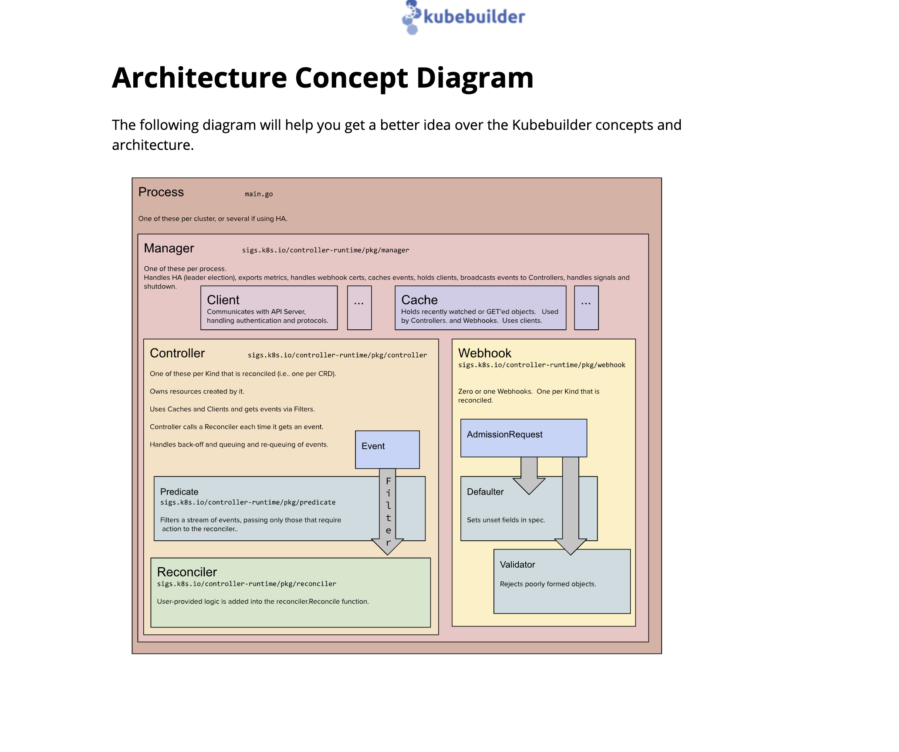

<!--
 * @Author: 27
 * @LastEditors: 27
 * @Date: 2023-10-20 12:11:02
 * @LastEditTime: 2023-10-23 11:25:00
 * @FilePath: /Coding-Daily/content/examples/operator/doc.md
 * @description: type some description
-->
# operator 部署尝试

## bukebuilder 架构图


## 初始化
```shell
kubebuilder init --domain tutorial.kubebuilder.io --repo tutorial.kubebuilder.io/operator-demo
```

## 安装crd
```shell
make install
```

## 部署controller
修改使用 gcr.io 镜像仓库的镜像地址

对于中国大陆用户，可能无法访问 Google 镜像仓库 gcr.io，因此需要修改 config/default/manager_auth_proxy_patch.yaml 文件中的镜像地址，将其中 gcr.io/kube-rbac-proxy:v0.5.0 修改为 jimmysong/kubebuilder-kube-rbac-proxy:v0.5.0。
目前使用自己制作的：wnz27/kubebuilder-example1:latest@sha256:e32e321da6c52e348456e969193cddab5df52eea431800b1e8b5a24c915d168c
以及 proxy 也是自己制作的： wnz27/kube-proxy-rbac:v0.15.0
这里需要注意的就是目标集群的操作系统，build 的

本地运行controller
```shell
make run
```
部署到 k8s 集群
执行下面的命令部署 controller 到 Kubernetes 上，这一步将会在本地构建 controller 的镜像，并推送到 DockerHub 上，然后在 Kubernetes 上部署 Deployment 资源。
```shell
make docker-build docker-push IMG=wnz27/kubebuilder-example1:latest
# 跨平台构建
make docker-buildx docker-push IMG=wnz27/kubebuilder-example1:v2
make docker-buildx docker-push IMG=wnz27/kubebuilder-example1:v3
make deploy IMG=wnz27/kubebuilder-example1:v2
make deploy IMG=wnz27/kubebuilder-example1:v3
```
### 修改 Makefile
> 知道 arch 的话可以修改这个值，镜像构建比较快
```shell
PLATFORMS ?= linux/arm64,linux/amd64,linux/s390x,linux/ppc64le
PLATFORMS ?= linux/amd64
```

## cr 部署
```shell
kubectl apply -f ./config/samples/batch_v1_cronjob.yaml
```

## 尝试 web server 部署
build web 服务 镜像， push 到镜像仓库
目前为：`wnz27/test_server_demo:v1.0.0`

### 创建一个针对 web server 的 api
```shell
kubebuilder create api --group back-end --version v1 --kind BizServer
```
有一个报错
```shell
kubebuilder有这么一个错误：
FATA[0002] failed to create API: unable to inject the resource to "base.go.kubebuilder.io/v4": API resource already exists 
```
目前猜测是 默认的 plugins 不支持多 api
ti

## 新起一个项目尝试下
operator-new
```shell
go mod init tutorial.kubebuilder.io/operator-new
kubebuilder init --domain tutorial.kubebuilder.io --plugins=go/v4 --repo tutorial.kubebuilder.io/operator-new
```

### 创建api
```shell
kubebuilder create api --group backend --version v1 --kind BizServer
```

### 定义crd
代码修改 定义
operator-new/api/v1/bizserver_types.go

### 修改 controller reconciel 逻辑
operator-new/internal/controller/bizserver_controller.go


### 部署 controller
```shell
make docker-buildx docker-push IMG=wnz27/kubebuilder-backend:v1
make deploy IMG=wnz27/kubebuilder-backend:v1
```

### 部署 cr
在 operator-new 目录下执行
```shell:
kubectl apply -f ./config/samples/backend_v1_bizserver.yaml
```

### 更新 controller 代码
```shell
make docker-buildx docker-push IMG=wnz27/kubebuilder-backend:v2
make deploy IMG=wnz27/kubebuilder-backend:v2
```


## TODO 
- [ ] 定一个web部署的领域模型
- [ ] 领域模型到 k8s 核心 api model transform


